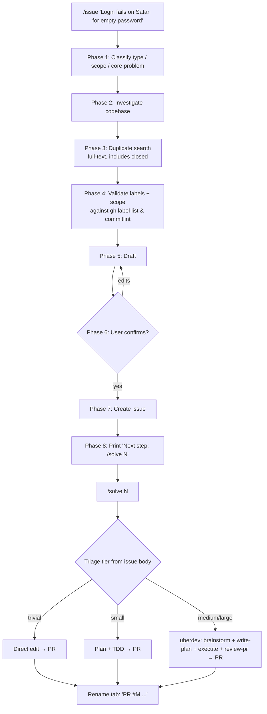

<div align="center">

# UberDev

**A personal Claude Code marketplace bundling opinionated GitHub-workflow slash commands.**

[](https://github.com/TheFJK/UberDev)
[](#license)
[](https://docs.claude.com/en/docs/claude-code/plugins)
[](#configuration)

```
   _   _ _               ____             
  | | | | |__   ___ _ __|  _ \  _____   __
  | | | | '_ \ / _ \ '__| | | |/ _ \ \ / /
  | |_| | |_) |  __/ |  | |_| |  __/\ V / 
   \___/|_.__/ \___|_|  |____/ \___| \_/  
```

**Two commands. Zero ceremony. Every issue, triaged and shipped.**

</div>

---

## TL;DR

Two slash commands that turn issue triage and resolution into one-line operations:

| Command | What it does |
|---|---|
| **`/solve <issue-number>`** | Spawns an autonomous Claude agent in a new terminal session (cmux / Ghostty / iTerm / Terminal.app / nohup) with **tier-aware triage** so trivial issues skip the brainstorm and large ones get the full plan-and-review pipeline. |
| **`/issue <description>`** | Creates a **well-investigated, deduped, label-validated** GitHub issue from a one-line ask — including codebase search, full-text dedup against closed issues (regression signals), commitlint scope validation, and a triage hint that `/solve` reads later. |

Both are **repo-agnostic** — they auto-detect the current repo via `gh repo view`. No per-repo config required.

---

## Install

```bash
# 1. Add this repo as a Claude Code marketplace
/plugin marketplace add TheFJK/UberDev

# 2. Install the plugin
/plugin install uberdev@uberdev

# 3. Smoke-test
/uberdev:issue trivial typo in README install step
```

Optional — once verified, deconflict any pre-existing global commands so the unqualified `/solve` and `/issue` resolve to the plugin:

```bash
rm -i ~/.claude/commands/solve.md ~/.claude/commands/issue.md
```

---

## Updating

Claude Code does **not** auto-update third-party plugins by default — third-party marketplaces ship with auto-update **off**. Two options:

### Manual update (default)

```bash
/plugin marketplace update uberdev   # refresh marketplace metadata
/plugin install uberdev@uberdev      # reinstall to pull the new version
```

Or interactively: `/plugin` → **Installed** → select `uberdev` → re-install.

### Enable auto-update for this marketplace (one-time)

`/plugin` → **Marketplaces** tab → select `uberdev` → toggle auto-update on. Claude Code then picks up new versions whenever the `version` field in `plugin.json` is bumped.

> **Disabling everything:** set `DISABLE_AUTOUPDATER=1` in your shell environment to globally disable Claude Code's auto-updater (affects Claude Code itself + every plugin).

Each release bumps the `version` field in `.claude-plugin/plugin.json`, so auto-update users get clean version transitions; manual users see the new version listed under the marketplace entry.

---

## Prerequisites

| Requirement | Why |
|---|---|
| **`gh` CLI** authenticated against your target repos | Used for repo detection, label/scope validation, dedup search, issue creation |
| **macOS** (Apple Silicon or Intel) | Terminal dispatch uses `osascript` for iTerm/Terminal.app; Linux/Windows degrade to detached `nohup` |
| **Claude Code 2.x+** with plugin support | Required for `/plugin marketplace add` |
| **One of:** cmux, Ghostty, iTerm2, Terminal.app | `/solve` auto-detects; falls back to detached `nohup` if none found |

---

## `/solve` — autonomous issue resolution

Auto-classifies a GitHub issue into a tier, then spawns an agent with a tier-appropriate workflow.

### Triage tiers

| Tier | Auto-detected from… | Spawned workflow |
|---|---|---|
| **trivial** | Labels `typo`, `docs`, `chore`, `good-first-issue`. Body <300 chars. Single file named. | Direct edit → test if touched code is tested → `/uberdev:simplify` → PR |
| **small** | Clear reproduction + error. Localized to one module. Estimated ≤50 LOC. | Lightweight TodoWrite plan (3–6 tasks) → TDD → `/uberdev:simplify` → PR |
| **medium / large** *(default)* | Labels `epic`, `architectural`, `infrastructure`. ≥3 files mentioned. Cross-package scope. Open questions. | Full `/uberdev:brainstorm` → `/uberdev:write-plan` → `/uberdev:subagent-driven-dev` → `/uberdev:review-pr` |

> **When in doubt, default to medium.** The spawned agent is explicitly told it may escalate to `/uberdev:brainstorm` mid-flight if the scope proves larger than triaged — **misclassification is recoverable, not catastrophic.**

### Manual overrides

```bash
/solve 123 --trivial                  # Force trivial tier
/solve 123 --small                    # Force small tier
/solve 123 --full                     # Force medium/large
/solve 123 --terminal=ghostty         # Force terminal dispatcher
SOLVE_TERMINAL=cmux /solve 123        # Same, via env var
```

### What runs in the spawned terminal

The agent inherits a model pin and effort cap so behavior is reproducible across runs:

```bash
claude \
  --model 'claude-opus-4-7[1m]' \
  --effort max \
  --worktree solve-issue-123 \
  --dangerously-skip-permissions \
  "$PROMPT"
```

After opening its PR, the spawned agent **renames its own terminal tab** from `#123 <issue-title>` to `PR #456 <pr-title>` via OSC escape sequences (or cmux's workspace API).

---

## `/issue` — investigation-first issue creation

Eight-phase pipeline that does the legwork **before** you draft, **before** you create, and **before** you spend a sprint chasing a duplicate ticket.



### Templates

`/issue` produces conventional-commit-style titles and one of four body templates depending on type:

<details>
<summary><strong>Bug (<code>fix</code>)</strong> — click to expand</summary>

```markdown
## Bug
[Clear description — what's broken]

## Expected behavior / Observed behavior
...

## Severity
- [ ] P0 — pages on-call, system down
- [ ] P1 — major feature broken
- [x] P2 — normal bug (default)
- [ ] P3 — minor / cosmetic

## Likely root cause
[Analysis from Phase 2 — connect symptom to specific code]

## Likely area
- `path/to/File` — `ClassName.methodName()` — [why relevant]

## Reproduction
1. ...

## Related
- [Closed/open issues from Phase 3 dedup search, else "none"]

**Triage hint:** <trivial|small|medium>
```

</details>

<details>
<summary><strong>Feature (<code>feat</code>)</strong></summary>

```markdown
## Summary
[What and why]

## Relevant code
- `path/to/File` — `ClassName` — [how it relates]

## Proposed approach
[Implementation strategy informed by Phase 2 investigation]

## Acceptance criteria
- [ ] [criterion]

## Related
- [Prior issues, if any]

**Triage hint:** <trivial|small|medium>
```

</details>

<details>
<summary><strong>Chore / Refactor</strong></summary>

```markdown
## Summary
[What needs doing and why]

## Relevant code
- `path/to/File` — [context]

**Triage hint:** <trivial|small|medium>
```

</details>

### Skip the codebase investigation

For docs/typo issues unrelated to code logic:

```bash
/issue Fix the install step in the README — wrong command --no-explore
```

---

## Configuration

| Env var | Purpose | Default |
|---|---|---|
| `SOLVE_TERMINAL` | Override `/solve`'s terminal dispatcher (`cmux` / `ghostty` / `iterm` / `terminal` / `nohup`) | Auto-detect |

That's it. No `.env` files, no per-repo config, no plugin settings to wire up.

---

## Repo layout

```
UberDev/
├── .claude-plugin/
│   └── marketplace.json          ← Marketplace manifest (lists 1 plugin)
├── plugins/
│   └── uberdev/
│       ├── .claude-plugin/
│       │   └── plugin.json       ← Plugin manifest
│       └── commands/
│           ├── solve.md          ← /solve command body (251 lines)
│           └── issue.md          ← /issue command body (204 lines)
├── .gitignore
└── README.md
```

The marketplace can host additional plugins later — drop a new folder under `plugins/` and add an entry to `marketplace.json`.

---

## Design decisions worth knowing

| Decision | Rationale |
|---|---|
| **Repo-agnostic by default** | Both commands derive `$REPO` from `gh repo view` at runtime. No hardcoded org/project IDs. |
| **No GitHub Project board auto-add** | Kept out of v0.1 to stay portable. May return in v0.2 via opt-in `.claude/board.json`. |
| **Model pin baked in** *(in `solve.md`)* | Spawned agents run on `claude-opus-4-7[1m]` for reproducibility across runs. Forks should adjust to their preferred model. |
| **macOS-first terminal dispatch** | `osascript` for iTerm / Terminal.app, native cmux/Ghostty CLI for those, `nohup` fallback elsewhere. |
| **Triage hint in every issue body** | Lets `/solve` skip re-classification and pick the right workflow without rereading the whole body. |
| **Conventional commits enforced** | `feat(scope):` / `fix(scope):` / `chore(scope):` / `refactor(scope):`. `enhancement` is a **label**, never a type. |
| **Wave-based parallel execution** *(see below)* | Plans declare task dependencies + file ownership; `subagent-driven-dev` fires every wave's tasks concurrently in one shared worktree. Controller-only git eliminates index races without per-task worktree ceremony. |

---

## Wave-based parallel execution (Pattern B)

`/solve` and `/uberdev:subagent-driven-dev` execute multi-task plans in **waves**: every task in a wave dispatches in parallel, waves run sequentially.

### How a plan declares it

`uberdev:write-plan` requires three new headers per task and an `## Execution Waves` summary:

```markdown
## Execution Waves

- **wave-1** (parallel): T1, T2, T3
- **wave-2** (parallel, depends on wave-1): T4, T5
- **wave-3** (sequential, depends on wave-2): T6

### Task 4: Recovery modes

**Depends on:** T1
**Wave:** wave-2
**Owns (file allowlist):** src/recovery.ts, tests/recovery.test.ts
```

Tasks share a wave **only** if their `Owns` allowlists are pairwise disjoint. Overlap → bump the later task to the next wave. The plan-writer's self-review checks acyclic deps + disjoint allowlists before saving.

### How execution stays race-free

| Concern | Pattern B solution |
|---|---|
| Two implementers writing the same file | Plan declares disjoint `Owns` allowlists; each implementer prompt enforces an allowlist + a denylist of sibling-owned paths |
| Concurrent `git add` / `git commit` racing on `.git/index.lock` | **Implementers never run git.** They edit files, run their tests, and report changed paths. The controller stages and commits per task, sequentially, in task ID order |
| A regression introduced by parallel edits hiding until later | Controller runs the project's full test suite once after all wave commits land — before any review dispatches |
| Reviewer of task A reading task B's code | Spec + code-quality reviewer prompts include the task's `BASE_SHA`, `HEAD_SHA`, and explicit allowlist; reviewers ignore changes outside |
| Worktree sprawl | One shared feature-branch worktree across all waves. No merge step between waves. Same worktree `/solve` already creates. |

### Why one shared worktree, not one per agent

Per-agent worktrees would isolate filesystems but add N `git worktree add` calls, an N-way merge step at the end of every wave, and cross-worktree resync time. Pattern B drops all of that by:

1. Letting agents share the worktree (safe because the plan proves disjoint file ownership).
2. Refusing to let agents touch git at all (safe because the controller serializes commits).

Result: maximum parallelism on edits, deterministic commit history, zero merge ceremony.

### Trade-offs you should know

- **Plans must decompose into truly disjoint file sets.** If wave-1 is one bottleneck task that everything depends on, you don't actually get parallelism — fix the decomposition.
- **Implementers can't self-stage.** If your task naturally wants ad-hoc commits (e.g., a bisect-friendly history mid-task), Pattern B forces you to wait for the controller. For most tasks that's fine.
- **The full-suite run between waves costs wall-time.** It's the trade for catching regressions before review dispatch instead of during.

---

## Roadmap

| Version | Status | Adds |
|---|---|---|
| **v0.1.0** | Released | `/solve`, `/issue` — repo-agnostic, no project-board logic |
| **v0.2.0** | Current | Bundles 4 workflow skills (`brainstorm`, `write-plan`, `execute-plan`, `subagent-driven-dev`), 6 review agents (`code-reviewer`, `code-simplifier`, `comment-analyzer`, `pr-test-analyzer`, `silent-failure-hunter`, `type-design-analyzer`), and 2 commands (`/uberdev:review-pr`, `/uberdev:simplify`) — `/solve` runs standalone with no superpowers / pr-review-toolkit / code-simplifier dependency |
| **v0.2.1** | Current | **Wave-based parallel execution (Pattern B):** `write-plan` requires `Depends on:` / `Wave:` / `Owns:` per task and an `## Execution Waves` summary; `subagent-driven-dev` dispatches every task in a wave concurrently in one shared feature-branch worktree, with the controller (not the implementers) running git to avoid index races. Cuts wall-time on multi-task plans roughly N× per wave with zero merge ceremony. |
| **v0.3** | Planned | Optional per-repo `.claude/board.json` for re-enabling project-board auto-add |
| **v0.4** | Maybe | Linux + Windows terminal dispatchers; configurable model pin via env |

---

## Bundled (since v0.2.0)

UberDev ships these so `/solve` and `/issue` work standalone — **no `superpowers`, `pr-review-toolkit`, or `code-simplifier` plugin install required**.

| Type | Slug | Source |
|---|---|---|
| Skill | `uberdev:brainstorm` | adapted from [`superpowers:brainstorming`](https://github.com/obra/superpowers) (MIT, Jesse Vincent) |
| Skill | `uberdev:write-plan` | adapted from `superpowers:writing-plans` |
| Skill | `uberdev:execute-plan` | adapted from `superpowers:executing-plans` |
| Skill | `uberdev:subagent-driven-dev` | adapted from `superpowers:subagent-driven-development` |
| Skill | `uberdev:finish-branch` | adapted from `superpowers:finishing-a-development-branch` (renamed) |
| Agent | `uberdev:code-reviewer` | verbatim from [`pr-review-toolkit`](https://github.com/anthropics/claude-code) (Apache 2.0, Anthropic) — CLAUDE.md/style compliance focus |
| Agent | `uberdev:plan-reviewer` | adapted from [`superpowers:code-reviewer`](https://github.com/obra/superpowers) (MIT, Jesse Vincent) — plan-vs-implementation focus (renamed `code-reviewer` → `plan-reviewer` to avoid slug collision) |
| Agent | `uberdev:comment-analyzer` | verbatim from `pr-review-toolkit` |
| Agent | `uberdev:pr-test-analyzer` | verbatim from `pr-review-toolkit` |
| Agent | `uberdev:silent-failure-hunter` | verbatim from `pr-review-toolkit` |
| Agent | `uberdev:type-design-analyzer` | verbatim from `pr-review-toolkit` |
| Agent | `uberdev:code-simplifier` | verbatim from [`code-simplifier`](https://github.com/anthropics/claude-code) v1.0.0 (Apache 2.0, Anthropic) |
| Command | `/uberdev:review-pr` | adapted from `pr-review-toolkit:/review-pr` |
| Command | `/uberdev:simplify` | new — thin wrapper dispatching `uberdev:code-simplifier` over the current diff |

Adaptations for the skills: dropped Visual Companion section from `brainstorm` (browser-based mockup server, never used by spawned headless `/solve` agents); retargeted all `superpowers:*` cross-references to `uberdev:*`; replaced references to non-bundled superpowers skills (`using-git-worktrees`, `test-driven-development`, `requesting-code-review`, `finishing-a-development-branch`) with inline prose preserving the discipline. Bundled upstream license texts are in `plugins/uberdev/licenses/`.

---

## FAQ

<details>
<summary><strong>Why "UberDev"?</strong></summary>

Personal brand. The marketplace name and repo are `UberDev`; the plugin inside is `uberdev` (lowercase to match Claude Code naming conventions).

</details>

<details>
<summary><strong>Will <code>/solve</code> work outside macOS?</strong></summary>

Partially. The terminal-dispatch chain falls through to `nohup` (detached background process with logs in `/tmp/solve-N.log`) on any platform without a recognized terminal app. You lose the per-issue tab and notifications, but the agent still runs.

</details>

<details>
<summary><strong>Why no <code>LICENSE</code> file?</strong></summary>

License is declared in `plugin.json` (`"license": "MIT"`) which is enough for the plugin metadata. A repo-root `LICENSE` file may land in a future patch for GitHub UI parity.

</details>

<details>
<summary><strong>How do I disable the plugin without uninstalling?</strong></summary>

```
/plugin disable uberdev@uberdev
```

Or edit `~/.claude/settings.json` and flip the entry to `false`:

```json
"enabledPlugins": {
  "uberdev@uberdev": false
}
```

</details>

---

## License

MIT. See [`plugins/uberdev/.claude-plugin/plugin.json`](plugins/uberdev/.claude-plugin/plugin.json) for the manifest declaration. A standalone `LICENSE` file may land later.

---

<div align="center">

**Built by [@TheFJK](https://github.com/TheFJK) for shipping fast on solo and small-team GitHub projects.**

*If you fork this, [open an issue](https://github.com/TheFJK/UberDev/issues) — I'd love to see what you build on top.*

</div>
