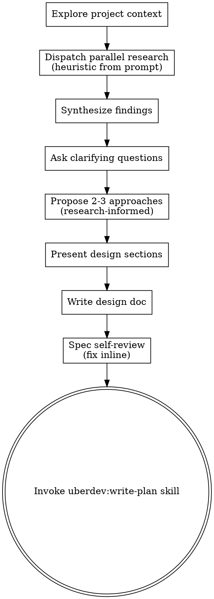

<!-- Vendored from obra/superpowers@e7a2d16476bf042e9add4699c9d018a90f86e4a6 (MIT) — see plugins/uberdev/licenses/superpowers-MIT.txt — the base this component was copied from and the SHA vendor.json records for it; stance is `fork`, so the local bytes diverge deliberately — see this component's stance_reason. -->

# Brainstorming Ideas Into Designs

Help turn ideas into fully formed designs and specs through natural collaborative dialogue.

Brainstorm operates as an orchestrator: dispatch parallel research agents to ground the design in real codebase + library context BEFORE asking clarifying questions. The agent is the manager, not the worker.

Start by understanding the current project context, dispatch parallel research agents (see checklist step 2), then ask clarifying questions one at a time to refine the idea. Once you understand what you're building, present the design, write the spec, and hand off to `uberdev:write-plan`. **Single forward pass — no per-section approval gates, no "review the spec" pauses.** The clarifying-questions phase is information-gathering; everything after that is the agent committing to its best design and moving forward.

**Note:** Don't write code or scaffold projects during brainstorming — that's `uberdev:write-plan`'s job. Brainstorming output is a spec doc, not implementation.

> **`/solve` and `/turbo` integration:** when invoked via `/uberdev:solve` or `/uberdev:turbo` for medium/large tier issues, the spawned agent now uses `/uberdev:orchestrator` instead of invoking this skill directly. The orchestrator delegates research-fanout, spec-writing, and plan-writing to dedicated subagents (`research-*`, `spec-writer`, `plan-writer`) that return summaries, keeping the spawned main lean. This skill remains the canonical reference for the brainstorm flow and is the right thing to invoke for ad-hoc design work outside `/solve`/`/turbo`.

## Anti-Pattern: "This Is Too Simple To Need A Design"

Every project goes through this process. A todo list, a single-function utility, a config change — all of them. "Simple" projects are where unexamined assumptions cause the most wasted work. The spec can be short (a few sentences for truly simple projects), but you MUST write a spec doc.

## Checklist

You MUST create a task for each of these items and complete them in order:

1. **Explore project context** — check files, docs, recent commits
2. **Dispatch routed research agents** (heuristic from prompt) — up to three existing roles (`research-codebase`, `research-patterns`, `research-prior-art`) in one wave; synthesize findings (3-5 bullets) before continuing. Skip only for truly trivial tasks. See "Parallel research dispatch" below.
3. **Offer visual companion** (if topic will involve visual questions) — its own message, not combined with a clarifying question. See the Visual Companion section below.
4. **Ask clarifying questions** — one at a time, informed by research; understand purpose/constraints/success criteria *(skipped in turbo mode — see "Turbo Mode" section)*
5. **Propose 2-3 approaches** — with trade-offs and your recommendation, grounded in research findings
6. **Present design** — in sections scaled to their complexity (informative, not approval-gated)
7. **Write design doc** — save to `docs/uberdev/specs/YYYY-MM-DD-<topic>-design.md` and commit
8. **Spec self-review** — quick inline check for placeholders, contradictions, ambiguity, scope (see below)
9. **Transition to implementation** — invoke `uberdev:write-plan` skill to create implementation plan

## Process Flow



**The terminal state is invoking `uberdev:write-plan`.** Do NOT invoke frontend-design, mcp-builder, or any other implementation skill. The ONLY skill you invoke after brainstorming is `uberdev:write-plan`.

## The Process

**Understanding the idea:**

- Check out the current project state first (files, docs, recent commits)
- Before asking detailed questions, assess scope: if the request describes multiple independent subsystems (e.g., "build a platform with chat, file storage, billing, and analytics"), flag this immediately. Don't spend questions refining details of a project that needs to be decomposed first.
- If the project is too large for a single spec, help the user decompose into sub-projects: what are the independent pieces, how do they relate, what order should they be built? Then brainstorm the first sub-project through the normal design flow. Each sub-project gets its own spec → plan → implementation cycle.
- For appropriately-scoped projects, ask questions one at a time to refine the idea
- Prefer multiple choice questions when possible, but open-ended is fine too
- Only one question per message - if a topic needs more exploration, break it into multiple questions
- Focus on understanding: purpose, constraints, success criteria

**Parallel research dispatch (default first step):**

After project-context exploration, before clarifying questions, dispatch up to three routed research agents in one wave. Read the user's request and infer the research questions yourself — don't ask the user what to research.

Heuristics for inferring research questions:
- Codebase questions ("how do we currently do X?", "any existing utilities for this?") → `research-codebase`
- In-repo precedent questions ("how did this repo solve a similar problem?") → `research-patterns`
- Library / external prior-art questions ("standard pattern for Y?", "has anyone built this before?") → `research-prior-art`

Synthesize findings into a brief summary before engaging the user with clarifying questions. The 2-3 approaches you propose later MUST be grounded in this research, not speculation.

For architecturally consequential choices, broaden the semantic focus supplied to these roles; do not create an unregistered generic role.

### Routed research execution

<!-- BEGIN child-callsite-contracts-v1 -->
```json
{
  "brainstorm.research.codebase":{"inputs":["working_dir","summary_path","question"],"optional_inputs":["format_retry","format_example_path"],"allowed_workflows":["solve","turbo"],"risk_scope":"none","risk_argument":[]},
  "brainstorm.research.prior_art":{"inputs":["working_dir","summary_path","question"],"optional_inputs":["format_retry","format_example_path"],"allowed_workflows":["solve","turbo"],"risk_scope":"none","risk_argument":[]},
  "brainstorm.research.library":{"inputs":["working_dir","summary_path","question"],"optional_inputs":["format_retry","format_example_path"],"allowed_workflows":["solve","turbo"],"risk_scope":"none","risk_argument":[]}
}
```
<!-- END child-callsite-contracts-v1 -->

When this skill receives a `routing_context` from `/solve` or `/turbo`, every provider edge MUST use `lib/child-dispatch.sh`. The handoffs contain no model, route, effort, service tier, sandbox, environment, or commands. Persist the user's brief as a private `brief_path`; never paste it into a child prompt. Run this setup once:

```bash uberdev-executable
set -euo pipefail
: "${UBERDEV_AGENT_PREPARED_REQUEST_JSON:?missing immutable routing context}"
UBERDEV_BRAINSTORM_PLUGIN_ROOT="${PLUGIN_ROOT:-${CLAUDE_PLUGIN_ROOT:-${CURSOR_PLUGIN_ROOT:-}}}"
. "$UBERDEV_BRAINSTORM_PLUGIN_ROOT/lib/child-dispatch.sh"
UBERDEV_BRAINSTORM_PREPARED_EDGES=(); UBERDEV_BRAINSTORM_PREPARED_INSTANCES=()
UBERDEV_BRAINSTORM_PREPARED_HANDOFFS=(); UBERDEV_BRAINSTORM_PREPARED_HANDOFF_SHA256S=()
UBERDEV_BRAINSTORM_PREPARED_RESULTS=()
UBERDEV_BRAINSTORM_PREPARED_STATUSES=(); UBERDEV_BRAINSTORM_DISPATCH_RECEIPTS=()
UBERDEV_BRAINSTORM_RECEIPT_STATUSES=(); UBERDEV_BRAINSTORM_RECEIPT_RESULTS=()
UBERDEV_BRAINSTORM_WAITED_INSTANCES=()
UBERDEV_BRAINSTORM_WAITED=0; UBERDEV_BRAINSTORM_BATCH_LAUNCHED=0
UBERDEV_BRAINSTORM_UNWIND_TIMEOUT="${UBERDEV_BRAINSTORM_UNWIND_TIMEOUT:-300}"
case "$UBERDEV_BRAINSTORM_UNWIND_TIMEOUT" in ''|*[!0-9]*|0) return 2 ;; esac
uberdev_brainstorm_reset_batch() {
  UBERDEV_BRAINSTORM_PREPARED_EDGES=(); UBERDEV_BRAINSTORM_PREPARED_INSTANCES=()
  UBERDEV_BRAINSTORM_PREPARED_HANDOFFS=(); UBERDEV_BRAINSTORM_PREPARED_HANDOFF_SHA256S=()
  UBERDEV_BRAINSTORM_PREPARED_RESULTS=()
  UBERDEV_BRAINSTORM_PREPARED_STATUSES=(); UBERDEV_BRAINSTORM_DISPATCH_RECEIPTS=()
  UBERDEV_BRAINSTORM_RECEIPT_STATUSES=(); UBERDEV_BRAINSTORM_RECEIPT_RESULTS=()
  UBERDEV_BRAINSTORM_WAITED_INSTANCES=()
  UBERDEV_BRAINSTORM_WAITED=0; UBERDEV_BRAINSTORM_BATCH_LAUNCHED=0
}
uberdev_unwind_child_receipts() {
  local index child_status result cleanup_rc=0
  for ((index=0; index<${#UBERDEV_BRAINSTORM_DISPATCH_RECEIPTS[@]}; index++)); do
    child_status="${UBERDEV_BRAINSTORM_RECEIPT_STATUSES[$index]}"
    result="${UBERDEV_BRAINSTORM_RECEIPT_RESULTS[$index]}"
    if ! uberdev_unwind_child "$child_status" "$result" "$UBERDEV_BRAINSTORM_UNWIND_TIMEOUT"; then cleanup_rc=1; fi
  done
  uberdev_brainstorm_reset_batch
  return "$cleanup_rc"
}
uberdev_brainstorm_drain_after_wait_failure() {
  local index instance waited child_status result skip cleanup_rc=0
  for ((index=0; index<${#UBERDEV_BRAINSTORM_DISPATCH_RECEIPTS[@]}; index++)); do
    instance="${UBERDEV_BRAINSTORM_DISPATCH_RECEIPTS[$index]}"
    skip=0
    for waited in "${UBERDEV_BRAINSTORM_WAITED_INSTANCES[@]}"; do
      [ "$instance" = "$waited" ] && skip=1 && break
    done
    [ "$skip" -eq 1 ] && continue
    child_status="${UBERDEV_BRAINSTORM_RECEIPT_STATUSES[$index]}"
    result="${UBERDEV_BRAINSTORM_RECEIPT_RESULTS[$index]}"
    if ! uberdev_unwind_child "$child_status" "$result" "$UBERDEV_BRAINSTORM_UNWIND_TIMEOUT"; then cleanup_rc=1; fi
  done
  uberdev_brainstorm_reset_batch
  return "$cleanup_rc"
}
uberdev_brainstorm_dispatch() {
  local edge="${@:1:1}" instance="${@:2:1}" role="${@:3:1}" inputs_json="${@:4:1}"
  [ "$#" -ge 4 ] || return 2
  local risks_json='[]' handoff handoff_sha256 result child_status create_rc cleanup_rc
  : "$role" # the registered edge manifest selects the role
  if uberdev_create_child_handoff "$edge" "$instance" "$inputs_json" "$risks_json"; then
    :
  else
    create_rc=$?; cleanup_rc=0
    uberdev_unwind_child_receipts || cleanup_rc=$?
    [ "$cleanup_rc" -eq 0 ] || echo "error: brainstorm receipt unwind failed after handoff edge=$edge instance=$instance" >&2
    return "$create_rc"
  fi
  handoff="$UBERDEV_CHILD_HANDOFF"
  handoff_sha256="$UBERDEV_CHILD_HANDOFF_SHA256"
  result="$UBERDEV_CHILD_RESULT"
  child_status="$UBERDEV_CHILD_STATUS"
  UBERDEV_BRAINSTORM_PREPARED_EDGES+=("$edge")
  UBERDEV_BRAINSTORM_PREPARED_INSTANCES+=("$instance")
  UBERDEV_BRAINSTORM_PREPARED_HANDOFFS+=("$handoff")
  UBERDEV_BRAINSTORM_PREPARED_HANDOFF_SHA256S+=("$handoff_sha256")
  UBERDEV_BRAINSTORM_PREPARED_RESULTS+=("$result")
  UBERDEV_BRAINSTORM_PREPARED_STATUSES+=("$child_status")
}
uberdev_brainstorm_launch_batch() {
  local index edge instance handoff handoff_sha256 result child_status dispatch_rc cleanup_rc
  local preflight_refs=()
  [ "${#UBERDEV_BRAINSTORM_PREPARED_HANDOFFS[@]}" -gt 0 ] || return 2
  [ "${#UBERDEV_BRAINSTORM_PREPARED_HANDOFFS[@]}" -eq "${#UBERDEV_BRAINSTORM_PREPARED_HANDOFF_SHA256S[@]}" ] || return 2
  for ((index=0; index<${#UBERDEV_BRAINSTORM_PREPARED_HANDOFFS[@]}; index++)); do
    preflight_refs+=("${UBERDEV_BRAINSTORM_PREPARED_HANDOFFS[$index]}" "${UBERDEV_BRAINSTORM_PREPARED_HANDOFF_SHA256S[$index]}")
  done
  uberdev_preflight_child_batch "${preflight_refs[@]}" || {
    dispatch_rc=$?; uberdev_brainstorm_reset_batch; return "$dispatch_rc"
  }
  for ((index=0; index<${#UBERDEV_BRAINSTORM_PREPARED_HANDOFFS[@]}; index++)); do
    edge="${UBERDEV_BRAINSTORM_PREPARED_EDGES[$index]}"
    instance="${UBERDEV_BRAINSTORM_PREPARED_INSTANCES[$index]}"
    handoff="${UBERDEV_BRAINSTORM_PREPARED_HANDOFFS[$index]}"
    handoff_sha256="${UBERDEV_BRAINSTORM_PREPARED_HANDOFF_SHA256S[$index]}"
    result="${UBERDEV_BRAINSTORM_PREPARED_RESULTS[$index]}"
    child_status="${UBERDEV_BRAINSTORM_PREPARED_STATUSES[$index]}"
    if uberdev_dispatch_child "$edge" "$handoff" "$handoff_sha256" "$result" "$child_status" >/dev/null; then
      UBERDEV_BRAINSTORM_DISPATCH_RECEIPTS+=("$instance")
      UBERDEV_BRAINSTORM_RECEIPT_STATUSES+=("$child_status")
      UBERDEV_BRAINSTORM_RECEIPT_RESULTS+=("$result")
    else
      dispatch_rc=$?; cleanup_rc=0
      uberdev_unwind_child_receipts || cleanup_rc=$?
      [ "$cleanup_rc" -eq 0 ] || echo "error: bounded brainstorm unwind failed after edge=$edge instance=$instance" >&2
      return "$dispatch_rc"
    fi
  done
  UBERDEV_BRAINSTORM_BATCH_LAUNCHED=1
}
uberdev_brainstorm_wait() {
  # A non-empty default cannot ride along on the slice — `${@:2:1}` is a slice,
  # not a parameter, so the `:-300` fallback has to be a second assignment.
  local wanted="${@:1:1}" timeout_s="${@:2:1}" index instance child_status result wait_rc cleanup_rc
  [ "$#" -ge 1 ] || return 2
  timeout_s="${timeout_s:-300}"
  if [ "$UBERDEV_BRAINSTORM_BATCH_LAUNCHED" -eq 0 ]; then
    uberdev_brainstorm_launch_batch || return $?
  fi
  for ((index=0; index<${#UBERDEV_BRAINSTORM_DISPATCH_RECEIPTS[@]}; index++)); do
    instance="${UBERDEV_BRAINSTORM_DISPATCH_RECEIPTS[$index]}"
    if [ "$instance" = "$wanted" ]; then
      child_status="${UBERDEV_BRAINSTORM_RECEIPT_STATUSES[$index]}"
      result="${UBERDEV_BRAINSTORM_RECEIPT_RESULTS[$index]}"
      if uberdev_wait_child "$child_status" "$result" "$timeout_s"; then
        :
      else
        wait_rc=$?; cleanup_rc=0
        uberdev_brainstorm_drain_after_wait_failure || cleanup_rc=$?
        [ "$cleanup_rc" -eq 0 ] || echo "error: bounded brainstorm sibling unwind failed after wait instance=$wanted" >&2
        return "$wait_rc"
      fi
      UBERDEV_BRAINSTORM_WAITED_INSTANCES+=("$wanted")
      UBERDEV_BRAINSTORM_WAITED=$((UBERDEV_BRAINSTORM_WAITED + 1))
      if [ "$UBERDEV_BRAINSTORM_WAITED" -eq "${#UBERDEV_BRAINSTORM_DISPATCH_RECEIPTS[@]}" ]; then
        uberdev_brainstorm_reset_batch
      fi
      return 0
    fi
  done
  cleanup_rc=0
  uberdev_brainstorm_drain_after_wait_failure || cleanup_rc=$?
  [ "$cleanup_rc" -eq 0 ] || echo "error: bounded brainstorm sibling unwind failed after missing receipt instance=$wanted" >&2
  return 2
}
BRAINSTORM_WORKING_DIR_JSON="$(python3 -I -B -c 'import json,sys; print(json.dumps(sys.argv[1],separators=(",",":")))' "$working_dir")"
BRAINSTORM_CODEBASE_SUMMARY_PATH_JSON="$(python3 -I -B -c 'import json,sys; print(json.dumps(sys.argv[1],separators=(",",":")))' "$codebase_summary_path")"
BRAINSTORM_PATTERNS_SUMMARY_PATH_JSON="$(python3 -I -B -c 'import json,sys; print(json.dumps(sys.argv[1],separators=(",",":")))' "$patterns_summary_path")"
BRAINSTORM_LIBRARY_SUMMARY_PATH_JSON="$(python3 -I -B -c 'import json,sys; print(json.dumps(sys.argv[1],separators=(",",":")))' "$library_summary_path")"
BRAINSTORM_CODEBASE_QUESTION_JSON="$(python3 -I -B -c 'import json,sys; print(json.dumps(sys.argv[1],separators=(",",":")))' "$codebase_question")"
BRAINSTORM_PRIOR_ART_QUESTION_JSON="$(python3 -I -B -c 'import json,sys; print(json.dumps(sys.argv[1],separators=(",",":")))' "$prior_art_question")"
BRAINSTORM_LIBRARY_QUESTION_JSON="$(python3 -I -B -c 'import json,sys; print(json.dumps(sys.argv[1],separators=(",",":")))' "$library_question")"
BRAINSTORM_CODEBASE_INPUTS="$(uberdev_child_inputs_build brainstorm.research.codebase \
  working_dir "$BRAINSTORM_WORKING_DIR_JSON" summary_path "$BRAINSTORM_CODEBASE_SUMMARY_PATH_JSON" question "$BRAINSTORM_CODEBASE_QUESTION_JSON")"
BRAINSTORM_PRIOR_ART_INPUTS="$(uberdev_child_inputs_build brainstorm.research.prior_art \
  working_dir "$BRAINSTORM_WORKING_DIR_JSON" summary_path "$BRAINSTORM_PATTERNS_SUMMARY_PATH_JSON" question "$BRAINSTORM_PRIOR_ART_QUESTION_JSON")"
BRAINSTORM_LIBRARY_INPUTS="$(uberdev_child_inputs_build brainstorm.research.library \
  working_dir "$BRAINSTORM_WORKING_DIR_JSON" summary_path "$BRAINSTORM_LIBRARY_SUMMARY_PATH_JSON" question "$BRAINSTORM_LIBRARY_QUESTION_JSON")"
```

Allocate each `summary_path` as a private regular run artifact first. Construct
all selected handoffs with the exact three manifest keys above; the builder
rejects additions. The calls below only prepare handoffs. The first wait
preflights the whole selected batch before dispatching any provider.

```bash uberdev-executable edge=brainstorm.research.codebase
uberdev_brainstorm_dispatch brainstorm.research.codebase brainstorm-research-codebase-a1 research-codebase "$BRAINSTORM_CODEBASE_INPUTS"
```

```bash uberdev-executable edge=brainstorm.research.prior_art
uberdev_brainstorm_dispatch brainstorm.research.prior_art brainstorm-research-prior-art-a1 research-patterns "$BRAINSTORM_PRIOR_ART_INPUTS"
```

```bash uberdev-executable edge=brainstorm.research.library
uberdev_brainstorm_dispatch brainstorm.research.library brainstorm-research-library-a1 research-prior-art "$BRAINSTORM_LIBRARY_INPUTS"
```

```bash uberdev-executable barrier=brainstorm.research
UBERDEV_BRAINSTORM_BARRIER_INSTANCES=("${UBERDEV_BRAINSTORM_PREPARED_INSTANCES[@]}")
for instance in "${UBERDEV_BRAINSTORM_BARRIER_INSTANCES[@]}"; do
  uberdev_brainstorm_wait "$instance"
done
```

Only wait for edges actually selected by the heuristic. For a malformed result,
retain its selected edge, role, inputs, and `a1` identity, then execute exactly
one fresh format retry:

```bash uberdev-executable retry=format
BRAINSTORM_FORMAT_INPUTS="$(uberdev_child_inputs_format_retry "$failed_edge" "$failed_inputs_json" "$format_example_path")"
format_retry_instance="${failed_instance%-a1}-a2"
uberdev_brainstorm_dispatch "$failed_edge" "$format_retry_instance" "$failed_role" "$BRAINSTORM_FORMAT_INPUTS"
uberdev_brainstorm_wait "$format_retry_instance"
```

Research is advisory in ad-hoc brainstorming except that a requested codebase-grounded design MUST have usable codebase evidence. If no routing context is present (standalone ad-hoc use), research those dimensions in the host context; never enter an unregistered provider path.

The synthesis step reads the summary text into context verbatim; no re-derivation required.

**Skip parallel research only when:**
- Truly trivial: config tweak, rename, single-line fix, typo
- One approach is obviously dominant AND no codebase context is needed
- User has already provided exhaustive inline context

**Turbo mode (when `--turbo` is in `$ARGUMENTS`):**

If the user invoked this skill with `--turbo` (e.g. via `/turbo`), skip the clarifying-questions loop entirely:

1. After parallel research synthesis, present the 2-3 approaches with your recommendation as **informational text** (so the user can audit the design choice post-hoc).
2. Auto-select the recommendation — proceed straight to "Presenting the design" without waiting for user input.
3. Continue through design → spec → write-plan exactly as the non-turbo flow does. Spec and plan are written to disk before implementation, and the user can interrupt to revise at any point — see "Single forward pass" in Key Principles.
4. **Propagate `--turbo` forward.** When invoking `uberdev:write-plan` (and any downstream skill it hands off to), pass `--turbo` so the entire pipeline stays unattended. Dropping the flag at any handoff turns `/turbo` into an attended flow.

**Exploring approaches:**

- Propose 2-3 different approaches with trade-offs, grounded in the research synthesis above
- Present options conversationally with your recommendation and reasoning
- Lead with your recommended option and explain why

**Presenting the design:**

- Once you believe you understand what you're building, present the design as a single coherent message
- Scale each section to its complexity: a few sentences if straightforward, up to 200-300 words if nuanced
- Cover: architecture, components, data flow, error handling, testing
- Don't pause for per-section approval. The user will speak up if something is wrong; otherwise proceed to writing the spec doc

**Design for isolation and clarity:**

- Break the system into smaller units that each have one clear purpose, communicate through well-defined interfaces, and can be understood and tested independently
- For each unit, you should be able to answer: what does it do, how do you use it, and what does it depend on?
- Can someone understand what a unit does without reading its internals? Can you change the internals without breaking consumers? If not, the boundaries need work.
- Smaller, well-bounded units are also easier for you to work with - you reason better about code you can hold in context at once, and your edits are more reliable when files are focused. When a file grows large, that's often a signal that it's doing too much.

**Working in existing codebases:**

- Explore the current structure before proposing changes. Follow existing patterns.
- Where existing code has problems that affect the work (e.g., a file that's grown too large, unclear boundaries, tangled responsibilities), include targeted improvements as part of the design - the way a good developer improves code they're working in.
- Don't propose unrelated refactoring. Stay focused on what serves the current goal.

## After the Design

```yaml lineage
edge_id: brainstorm.write_plan
model_invocation: false
```

**Documentation:**

- Write the validated design (spec) to `docs/uberdev/specs/YYYY-MM-DD-<topic>-design.md`
  - (User preferences for spec location override this default)
- Commit the design document to git

**Spec Self-Review:**
After writing the spec document, look at it with fresh eyes:

1. **Placeholder scan:** Any "TBD", "TODO", incomplete sections, or vague requirements? Fix them.
2. **Internal consistency:** Do any sections contradict each other? Does the architecture match the feature descriptions?
3. **Scope check:** Is this focused enough for a single implementation plan, or does it need decomposition?
4. **Ambiguity check:** Could any requirement be interpreted two different ways? If so, pick one and make it explicit.

Fix any issues inline. No need to re-review — just fix and move on.

**Implementation:**

- Immediately invoke the `uberdev:write-plan` skill to create a detailed implementation plan. This skill transition is `model_invocation: false`: propagate only `context_file`, `context_sha256`, root `run_id`, `workflow`, and `issue_num` when a routing context exists. Do not call the resolver and do not attach model/effort fields at the skill boundary. **No "review the spec" pause.** If the user wants to revise the spec, they'll interrupt; otherwise the plan-writing phase is the next forward step.
- **Forward `--turbo` if it was in `$ARGUMENTS`** — invoke as `uberdev:write-plan --turbo …` so the downstream pipeline (write-plan → subagent-driven-dev → finish-branch) stays unattended end-to-end.
- Do NOT invoke any other skill. `uberdev:write-plan` is the next step.

## Key Principles

- **One question at a time** - Don't overwhelm with multiple questions during the clarifying phase
- **Multiple choice preferred** - Easier to answer than open-ended when possible
- **YAGNI ruthlessly** - Remove unnecessary features from all designs
- **Explore alternatives** - Always propose 2-3 approaches before settling
- **Single forward pass** - Once clarifying questions are done, move design → spec → write-plan in one flow without approval gates. The user can interrupt to revise; don't proactively pause for sign-off. *Turbo mode (`--turbo` in args) takes this further by collapsing the clarifying-questions loop entirely — it never adds a gate, only removes one.*

## Visual Companion

A browser-based companion for showing mockups, diagrams, and visual options during brainstorming. Available as a tool — not a mode. Accepting the companion means it's available for questions that benefit from visual treatment; it does NOT mean every question goes through the browser.

**Offering the companion:** When you anticipate that upcoming questions will involve visual content (mockups, layouts, diagrams), offer it once for consent:
> "Some of what we're working on might be easier to explain if I can show it to you in a web browser. I can put together mockups, diagrams, comparisons, and other visuals as we go. This feature is still new and can be token-intensive. Want to try it? (Requires opening a local URL)"

**This offer MUST be its own message.** Do not combine it with clarifying questions, context summaries, or any other content. The message should contain ONLY the offer above and nothing else. Wait for the user's response before continuing. If they decline, proceed with text-only brainstorming.

**Per-question decision:** Even after the user accepts, decide FOR EACH QUESTION whether to use the browser or the terminal. The test: **would the user understand this better by seeing it than reading it?**

- **Use the browser** for content that IS visual — mockups, wireframes, layout comparisons, architecture diagrams, side-by-side visual designs
- **Use the terminal** for content that is text — requirements questions, conceptual choices, tradeoff lists, A/B/C/D text options, scope decisions

A question about a UI topic is not automatically a visual question. "What does personality mean in this context?" is a conceptual question — use the terminal. "Which wizard layout works better?" is a visual question — use the browser.

If they agree to the companion, read the detailed guide before proceeding:
`skills/brainstorm/visual-companion.md`

## Fast-path: direction selection without visual companion

When you've generated 2-4 design directions and the user just needs to pick one (no visual mockup work yet), use AskUserQuestion instead of file-polling:

```
AskUserQuestion({
  question: "Which design direction should we explore further?",
  options: [
    { label: "A", description: "Direction A: ..." },
    { label: "B", description: "Direction B: ..." },
    { label: "C", description: "Direction C: ..." }
  ]
})
```

**Use AskUserQuestion when:**
- You have a small, discrete set of options (2-5)
- The user does not need to interact with a visual mockup yet
- Speed matters (no companion server startup needed)

**Use the visual companion when:**
- The user wants to see live HTML/CSS mockups
- Multiple design dimensions need parallel exploration
- The decision is informed by visual artifacts, not just descriptions

## Threat model

The visual companion's WebSocket+HTTP server (`scripts/server.cjs`) is built around a **single-user, localhost-only** trust model — security guarantees are enforced by the operating environment, not by the server code itself.

- **Localhost-only bind.** The server listens on `127.0.0.1` by design. Never override the bind address to a routable interface (`0.0.0.0`, `::`, or a specific external IP) — there is no transport encryption and no auth, so any reachable network peer would gain full read/write access to brainstorm session state.
- **No authentication.** The protocol assumes the caller is the local user who started the server. There are no tokens, no per-origin checks beyond CORS-on-localhost, and no rate limits.
- **Single-user assumption.** Do NOT run on a shared / multi-user host (e.g. a build agent, a VPS with multiple SSH users, a remote desktop). Any local user could connect to the loopback port and read/write session data.
- **No exposure via reverse proxy or tunnel.** Do not front the server with nginx, Caddy, ngrok, Cloudflare Tunnel, or similar — that re-introduces the network-exposure risk the bind decision is designed to prevent.

If the use case ever requires multi-user or network access, the correct path is a new server with a proper auth model — not loosening the bind address on this one.
