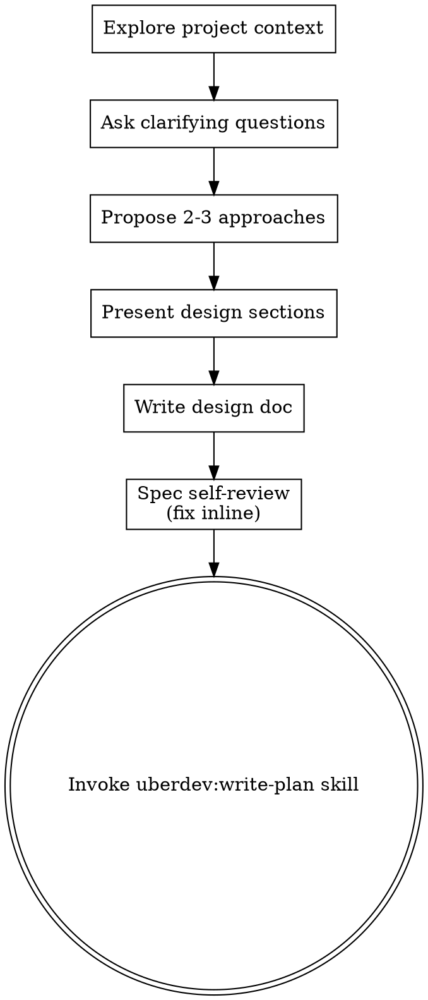

# Brainstorming Ideas Into Designs

Help turn ideas into fully formed designs and specs through natural collaborative dialogue.

Start by understanding the current project context, then ask clarifying questions one at a time to refine the idea. Once you understand what you're building, present the design, write the spec, and hand off to `uberdev:write-plan`. **Single forward pass — no per-section approval gates, no "review the spec" pauses.** The clarifying-questions phase is information-gathering; everything after that is the agent committing to its best design and moving forward.

**Note:** Don't write code or scaffold projects during brainstorming — that's `uberdev:write-plan`'s job. Brainstorming output is a spec doc, not implementation.

## Anti-Pattern: "This Is Too Simple To Need A Design"

Every project goes through this process. A todo list, a single-function utility, a config change — all of them. "Simple" projects are where unexamined assumptions cause the most wasted work. The spec can be short (a few sentences for truly simple projects), but you MUST write a spec doc.

## Checklist

You MUST create a task for each of these items and complete them in order:

1. **Explore project context** — check files, docs, recent commits
2. **Offer visual companion** (if topic will involve visual questions) — its own message, not combined with a clarifying question. See the Visual Companion section below.
3. **Ask clarifying questions** — one at a time, understand purpose/constraints/success criteria
4. **Propose 2-3 approaches** — with trade-offs and your recommendation
5. **Present design** — in sections scaled to their complexity (informative, not approval-gated)
6. **Write design doc** — save to `docs/uberdev/specs/YYYY-MM-DD-<topic>-design.md` and commit
7. **Spec self-review** — quick inline check for placeholders, contradictions, ambiguity, scope (see below)
8. **Transition to implementation** — invoke `uberdev:write-plan` skill to create implementation plan

## Process Flow

**The terminal state is invoking `uberdev:write-plan`.** Do NOT invoke frontend-design, mcp-builder, or any other implementation skill. The ONLY skill you invoke after brainstorming is `uberdev:write-plan`.

## The Process

**Understanding the idea:**

- Check out the current project state first (files, docs, recent commits)
- Before asking detailed questions, assess scope: if the request describes multiple independent subsystems (e.g., "build a platform with chat, file storage, billing, and analytics"), flag this immediately. Don't spend questions refining details of a project that needs to be decomposed first.
- If the project is too large for a single spec, help the user decompose into sub-projects: what are the independent pieces, how do they relate, what order should they be built? Then brainstorm the first sub-project through the normal design flow. Each sub-project gets its own spec → plan → implementation cycle.
- For appropriately-scoped projects, ask questions one at a time to refine the idea
- Prefer multiple choice questions when possible, but open-ended is fine too
- Only one question per message - if a topic needs more exploration, break it into multiple questions
- Focus on understanding: purpose, constraints, success criteria

**Exploring approaches:**

- Propose 2-3 different approaches with trade-offs
- Present options conversationally with your recommendation and reasoning
- Lead with your recommended option and explain why

**Parallel exploration for high-stakes designs:**

For architectural changes, large features, or any design where the wrong choice is expensive to reverse, the 2-3 approaches benefit from **independent parallel exploration** instead of single-agent sequential generation. A single thread tends to anchor on the first idea — parallel agents who don't see each other reach different reasoning paths.

Pattern: in a single message, dispatch 2-3 `Task` agents, each tasked with **one specific design direction** (e.g., "explore the event-driven approach with BullMQ", "explore the polling approach with cron", "explore the webhook approach"). Each agent receives the same project context but only its own direction; they do not see each other's output. Aggregate their trade-off lists, then present the consolidated comparison to the user with your recommendation.

**Skip parallel exploration when:**
- The design is small/local (a single function, a config tweak — single-thread is fine)
- One approach is obviously dominant (don't burn agents to confirm the obvious)
- Token budget is tight and the user is iterating fast — a quick text-based comparison is more responsive than a multi-agent spawn

**Presenting the design:**

- Once you believe you understand what you're building, present the design as a single coherent message
- Scale each section to its complexity: a few sentences if straightforward, up to 200-300 words if nuanced
- Cover: architecture, components, data flow, error handling, testing
- Don't pause for per-section approval. The user will speak up if something is wrong; otherwise proceed to writing the spec doc

**Design for isolation and clarity:**

- Break the system into smaller units that each have one clear purpose, communicate through well-defined interfaces, and can be understood and tested independently
- For each unit, you should be able to answer: what does it do, how do you use it, and what does it depend on?
- Can someone understand what a unit does without reading its internals? Can you change the internals without breaking consumers? If not, the boundaries need work.
- Smaller, well-bounded units are also easier for you to work with - you reason better about code you can hold in context at once, and your edits are more reliable when files are focused. When a file grows large, that's often a signal that it's doing too much.

**Working in existing codebases:**

- Explore the current structure before proposing changes. Follow existing patterns.
- Where existing code has problems that affect the work (e.g., a file that's grown too large, unclear boundaries, tangled responsibilities), include targeted improvements as part of the design - the way a good developer improves code they're working in.
- Don't propose unrelated refactoring. Stay focused on what serves the current goal.

## After the Design

**Documentation:**

- Write the validated design (spec) to `docs/uberdev/specs/YYYY-MM-DD-<topic>-design.md`
  - (User preferences for spec location override this default)
- Commit the design document to git

**Spec Self-Review:**
After writing the spec document, look at it with fresh eyes:

1. **Placeholder scan:** Any "TBD", "TODO", incomplete sections, or vague requirements? Fix them.
2. **Internal consistency:** Do any sections contradict each other? Does the architecture match the feature descriptions?
3. **Scope check:** Is this focused enough for a single implementation plan, or does it need decomposition?
4. **Ambiguity check:** Could any requirement be interpreted two different ways? If so, pick one and make it explicit.

Fix any issues inline. No need to re-review — just fix and move on.

**Implementation:**

- Immediately invoke the `uberdev:write-plan` skill to create a detailed implementation plan. **No "review the spec" pause.** If the user wants to revise the spec, they'll interrupt; otherwise the plan-writing phase is the next forward step.
- Do NOT invoke any other skill. `uberdev:write-plan` is the next step.

## Key Principles

- **One question at a time** - Don't overwhelm with multiple questions during the clarifying phase
- **Multiple choice preferred** - Easier to answer than open-ended when possible
- **YAGNI ruthlessly** - Remove unnecessary features from all designs
- **Explore alternatives** - Always propose 2-3 approaches before settling
- **Single forward pass** - Once clarifying questions are done, move design → spec → write-plan in one flow without approval gates. The user can interrupt to revise; don't proactively pause for sign-off.

## Visual Companion

A browser-based companion for showing mockups, diagrams, and visual options during brainstorming. Available as a tool — not a mode. Accepting the companion means it's available for questions that benefit from visual treatment; it does NOT mean every question goes through the browser.

**Offering the companion:** When you anticipate that upcoming questions will involve visual content (mockups, layouts, diagrams), offer it once for consent:
> "Some of what we're working on might be easier to explain if I can show it to you in a web browser. I can put together mockups, diagrams, comparisons, and other visuals as we go. This feature is still new and can be token-intensive. Want to try it? (Requires opening a local URL)"

**This offer MUST be its own message.** Do not combine it with clarifying questions, context summaries, or any other content. The message should contain ONLY the offer above and nothing else. Wait for the user's response before continuing. If they decline, proceed with text-only brainstorming.

**Per-question decision:** Even after the user accepts, decide FOR EACH QUESTION whether to use the browser or the terminal. The test: **would the user understand this better by seeing it than reading it?**

- **Use the browser** for content that IS visual — mockups, wireframes, layout comparisons, architecture diagrams, side-by-side visual designs
- **Use the terminal** for content that is text — requirements questions, conceptual choices, tradeoff lists, A/B/C/D text options, scope decisions

A question about a UI topic is not automatically a visual question. "What does personality mean in this context?" is a conceptual question — use the terminal. "Which wizard layout works better?" is a visual question — use the browser.

If they agree to the companion, read the detailed guide before proceeding:
`skills/brainstorm/visual-companion.md`
