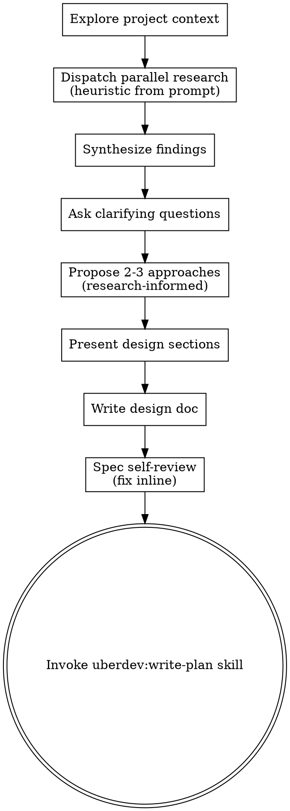

# Brainstorming Ideas Into Designs

Help turn ideas into fully formed designs and specs through natural collaborative dialogue.

Brainstorm operates as an orchestrator: dispatch parallel research agents to ground the design in real codebase + library context BEFORE asking clarifying questions. The agent is the manager, not the worker.

Start by understanding the current project context, dispatch parallel research agents (see checklist step 2), then ask clarifying questions one at a time to refine the idea. Once you understand what you're building, present the design, write the spec, and hand off to `uberdev:write-plan`. **Single forward pass — no per-section approval gates, no "review the spec" pauses.** The clarifying-questions phase is information-gathering; everything after that is the agent committing to its best design and moving forward.

**Note:** Don't write code or scaffold projects during brainstorming — that's `uberdev:write-plan`'s job. Brainstorming output is a spec doc, not implementation.

> **`/solve` and `/turbo` integration:** when invoked via `/uberdev:solve` or `/uberdev:turbo` for medium/large tier issues, the spawned agent now uses `/uberdev:orchestrator` instead of invoking this skill directly. The orchestrator delegates research-fanout, spec-writing, and plan-writing to dedicated subagents (`research-*`, `spec-writer`, `plan-writer`) that return summaries, keeping the spawned main lean. This skill remains the canonical reference for the brainstorm flow and is the right thing to invoke for ad-hoc design work outside `/solve`/`/turbo`.

## Anti-Pattern: "This Is Too Simple To Need A Design"

Every project goes through this process. A todo list, a single-function utility, a config change — all of them. "Simple" projects are where unexamined assumptions cause the most wasted work. The spec can be short (a few sentences for truly simple projects), but you MUST write a spec doc.

## Checklist

You MUST create a task for each of these items and complete them in order:

1. **Explore project context** — check files, docs, recent commits
2. **Dispatch parallel research agents** (heuristic from prompt) — 2-3 `Explore`/`general-purpose` agents in one message researching codebase patterns, prior art, and library docs; synthesize findings (3-5 bullets) before continuing. Skip only for truly trivial tasks. **Issue-research short-circuit:** if invoked with an issue number context (e.g. via `/solve <N>` or `/turbo <N>`) and `.uberdev/research/issue-<N>/` exists, read its summaries (`codebase.md` and, if present, `patterns.md`) and treat them as the codebase + in-repo-prior-art research input — skip dispatching the equivalent agents. The short-circuit is **per-topic**, not all-or-nothing: continue to dispatch agents for topics not covered (e.g. external prior art via WebSearch/Context7). See "Parallel research dispatch" and "Issue-research short-circuit" below.
3. **Offer visual companion** (if topic will involve visual questions) — its own message, not combined with a clarifying question. See the Visual Companion section below.
4. **Ask clarifying questions** — one at a time, informed by research; understand purpose/constraints/success criteria *(skipped in turbo mode — see "Turbo Mode" section)*
5. **Propose 2-3 approaches** — with trade-offs and your recommendation, grounded in research findings
6. **Present design** — in sections scaled to their complexity (informative, not approval-gated)
7. **Write design doc** — save to `docs/uberdev/specs/YYYY-MM-DD-<topic>-design.md` and commit
8. **Spec self-review** — quick inline check for placeholders, contradictions, ambiguity, scope (see below)
9. **Transition to implementation** — invoke `uberdev:write-plan` skill to create implementation plan

## Process Flow



**The terminal state is invoking `uberdev:write-plan`.** Do NOT invoke frontend-design, mcp-builder, or any other implementation skill. The ONLY skill you invoke after brainstorming is `uberdev:write-plan`.

## The Process

**Understanding the idea:**

- Check out the current project state first (files, docs, recent commits)
- Before asking detailed questions, assess scope: if the request describes multiple independent subsystems (e.g., "build a platform with chat, file storage, billing, and analytics"), flag this immediately. Don't spend questions refining details of a project that needs to be decomposed first.
- If the project is too large for a single spec, help the user decompose into sub-projects: what are the independent pieces, how do they relate, what order should they be built? Then brainstorm the first sub-project through the normal design flow. Each sub-project gets its own spec → plan → implementation cycle.
- For appropriately-scoped projects, ask questions one at a time to refine the idea
- Prefer multiple choice questions when possible, but open-ended is fine too
- Only one question per message - if a topic needs more exploration, break it into multiple questions
- Focus on understanding: purpose, constraints, success criteria

**Parallel research dispatch (default first step):**

After project-context exploration, before clarifying questions, dispatch 2-3 research agents in a single message to gather context in parallel. Read the user's request and infer the research questions yourself — don't ask the user what to research.

Heuristics for inferring research questions:
- Codebase questions ("how do we currently do X?", "any existing utilities for this?") → `Explore` agent
- Library / prior-art questions ("standard pattern for Y?", "has anyone built this before?") → `general-purpose` agent with Context7 / web search

Synthesize findings into a brief summary before engaging the user with clarifying questions. The 2-3 approaches you propose later MUST be grounded in this research, not speculation.

For architecturally consequential choices, this pattern also supports independent parallel exploration of design directions (one agent per direction). See `uberdev:dispatching-parallel-agents`.

**Issue-research short-circuit (when an issue number is in scope):**

When this skill is invoked downstream of `/uberdev:issue` (i.e. the conversation has an issue number), `/issue` may have already run a 2-agent fanout (`research-codebase` + `research-patterns`) and persisted summaries to `.uberdev/research/issue-<N>/`. Read those instead of re-dispatching:

```bash
RESEARCH_DIR=".uberdev/research/issue-$ISSUE"
if [ -d "$RESEARCH_DIR" ] && [ -f "$RESEARCH_DIR/codebase.md" ]; then
  # Malformed-summary check — file must contain a `summary` field per the
  # research-codebase YAML return contract. If absent, fall through with a warning
  # rather than read garbage into the synthesis step.
  if ! grep -q '^summary:' "$RESEARCH_DIR/codebase.md"; then
    echo "warning: $RESEARCH_DIR/codebase.md missing 'summary:' field; using full parallel dispatch" >&2
  else
    ISSUE_UPDATED_ISO=$(gh issue view "$ISSUE" --json updatedAt --jq .updatedAt 2>/dev/null)
    if [ -z "$ISSUE_UPDATED_ISO" ]; then
      echo "warning: failed to fetch issue #$ISSUE updatedAt (gh auth/network/missing); using full parallel dispatch" >&2
    else
      # Normalise both timestamps to epoch seconds for portable comparison
      # (BSD/macOS first, GNU/Linux fallback). Avoids the macOS/Linux mtime-format
      # mismatch that would silently mis-rank summaries against gh's RFC-3339 output.
      ISSUE_UPDATED_EPOCH=$(date -j -f '%Y-%m-%dT%H:%M:%SZ' "$ISSUE_UPDATED_ISO" +%s 2>/dev/null \
                          || date -d "$ISSUE_UPDATED_ISO" +%s 2>/dev/null)
      CODEBASE_MTIME_EPOCH=$(stat -f %m "$RESEARCH_DIR/codebase.md" 2>/dev/null \
                           || stat -c %Y "$RESEARCH_DIR/codebase.md" 2>/dev/null)
      if [ -z "$ISSUE_UPDATED_EPOCH" ] || [ -z "$CODEBASE_MTIME_EPOCH" ]; then
        echo "warning: failed to normalise updatedAt or codebase.md mtime; using full parallel dispatch" >&2
      elif [ "$CODEBASE_MTIME_EPOCH" -lt "$ISSUE_UPDATED_EPOCH" ]; then
        # Stale: research summary is older than the most recent issue-body edit
        # → fall through to the full parallel-dispatch path so re-research picks up the change.
        :
      else
        # Fresh: read codebase.md (and patterns.md if present) verbatim into the synthesis
        # step. Per-topic skip flags tell the dispatch step which agents to omit.
        SHORTCIRCUIT_CODEBASE=1
        [ -f "$RESEARCH_DIR/patterns.md" ] && SHORTCIRCUIT_PATTERNS=1
      fi
    fi
  fi
fi
```

- **Per-topic skip, not all-or-nothing.** If `codebase.md` exists, skip the codebase-equivalent agent. If `patterns.md` exists, skip the in-repo-prior-art agent. Continue to dispatch agents for topics NOT covered (e.g. external prior art via WebSearch/Context7).
- **Stale check.** If the summary's mtime is older than `gh issue view <N> --json updatedAt --jq .updatedAt`, the issue body was edited after the research ran — fall back to the full parallel dispatch.
- **Malformed-summary fallback.** If the directory exists but the summary file is missing the `summary` section or is otherwise unreadable, log a one-line warning and fall through to the full parallel dispatch. Do not block.
- **Backwards compatibility.** Issues created before this change have no `.uberdev/research/issue-<N>/` directory; `[ -d ... ]` returns false and the skill proceeds with the existing parallel-dispatch path. No data migration needed.

The synthesis step reads the summary text into context verbatim; no re-derivation required.

**Skip parallel research only when:**
- Truly trivial: config tweak, rename, single-line fix, typo
- One approach is obviously dominant AND no codebase context is needed
- User has already provided exhaustive inline context

**Turbo mode (when `--turbo` is in `$ARGUMENTS`):**

If the user invoked this skill with `--turbo` (e.g. via `/turbo`), skip the clarifying-questions loop entirely:

1. After parallel research synthesis, present the 2-3 approaches with your recommendation as **informational text** (so the user can audit the design choice post-hoc).
2. Auto-select the recommendation — proceed straight to "Presenting the design" without waiting for user input.
3. Continue through design → spec → write-plan exactly as the non-turbo flow does. Spec and plan are written to disk before implementation, and the user can interrupt to revise at any point — see "Single forward pass" in Key Principles.
4. **Propagate `--turbo` forward.** When invoking `uberdev:write-plan` (and any downstream skill it hands off to), pass `--turbo` so the entire pipeline stays unattended. Dropping the flag at any handoff turns `/turbo` into an attended flow.

**Exploring approaches:**

- Propose 2-3 different approaches with trade-offs, grounded in the research synthesis above
- Present options conversationally with your recommendation and reasoning
- Lead with your recommended option and explain why

**Presenting the design:**

- Once you believe you understand what you're building, present the design as a single coherent message
- Scale each section to its complexity: a few sentences if straightforward, up to 200-300 words if nuanced
- Cover: architecture, components, data flow, error handling, testing
- Don't pause for per-section approval. The user will speak up if something is wrong; otherwise proceed to writing the spec doc

**Design for isolation and clarity:**

- Break the system into smaller units that each have one clear purpose, communicate through well-defined interfaces, and can be understood and tested independently
- For each unit, you should be able to answer: what does it do, how do you use it, and what does it depend on?
- Can someone understand what a unit does without reading its internals? Can you change the internals without breaking consumers? If not, the boundaries need work.
- Smaller, well-bounded units are also easier for you to work with - you reason better about code you can hold in context at once, and your edits are more reliable when files are focused. When a file grows large, that's often a signal that it's doing too much.

**Working in existing codebases:**

- Explore the current structure before proposing changes. Follow existing patterns.
- Where existing code has problems that affect the work (e.g., a file that's grown too large, unclear boundaries, tangled responsibilities), include targeted improvements as part of the design - the way a good developer improves code they're working in.
- Don't propose unrelated refactoring. Stay focused on what serves the current goal.

## After the Design

**Documentation:**

- Write the validated design (spec) to `docs/uberdev/specs/YYYY-MM-DD-<topic>-design.md`
  - (User preferences for spec location override this default)
- Commit the design document to git

**Spec Self-Review:**
After writing the spec document, look at it with fresh eyes:

1. **Placeholder scan:** Any "TBD", "TODO", incomplete sections, or vague requirements? Fix them.
2. **Internal consistency:** Do any sections contradict each other? Does the architecture match the feature descriptions?
3. **Scope check:** Is this focused enough for a single implementation plan, or does it need decomposition?
4. **Ambiguity check:** Could any requirement be interpreted two different ways? If so, pick one and make it explicit.

Fix any issues inline. No need to re-review — just fix and move on.

**Implementation:**

- Immediately invoke the `uberdev:write-plan` skill to create a detailed implementation plan. **No "review the spec" pause.** If the user wants to revise the spec, they'll interrupt; otherwise the plan-writing phase is the next forward step.
- **Forward `--turbo` if it was in `$ARGUMENTS`** — invoke as `uberdev:write-plan --turbo …` so the downstream pipeline (write-plan → subagent-driven-dev → finish-branch) stays unattended end-to-end.
- Do NOT invoke any other skill. `uberdev:write-plan` is the next step.

## Key Principles

- **One question at a time** - Don't overwhelm with multiple questions during the clarifying phase
- **Multiple choice preferred** - Easier to answer than open-ended when possible
- **YAGNI ruthlessly** - Remove unnecessary features from all designs
- **Explore alternatives** - Always propose 2-3 approaches before settling
- **Single forward pass** - Once clarifying questions are done, move design → spec → write-plan in one flow without approval gates. The user can interrupt to revise; don't proactively pause for sign-off. *Turbo mode (`--turbo` in args) takes this further by collapsing the clarifying-questions loop entirely — it never adds a gate, only removes one.*

## Visual Companion

A browser-based companion for showing mockups, diagrams, and visual options during brainstorming. Available as a tool — not a mode. Accepting the companion means it's available for questions that benefit from visual treatment; it does NOT mean every question goes through the browser.

**Offering the companion:** When you anticipate that upcoming questions will involve visual content (mockups, layouts, diagrams), offer it once for consent:
> "Some of what we're working on might be easier to explain if I can show it to you in a web browser. I can put together mockups, diagrams, comparisons, and other visuals as we go. This feature is still new and can be token-intensive. Want to try it? (Requires opening a local URL)"

**This offer MUST be its own message.** Do not combine it with clarifying questions, context summaries, or any other content. The message should contain ONLY the offer above and nothing else. Wait for the user's response before continuing. If they decline, proceed with text-only brainstorming.

**Per-question decision:** Even after the user accepts, decide FOR EACH QUESTION whether to use the browser or the terminal. The test: **would the user understand this better by seeing it than reading it?**

- **Use the browser** for content that IS visual — mockups, wireframes, layout comparisons, architecture diagrams, side-by-side visual designs
- **Use the terminal** for content that is text — requirements questions, conceptual choices, tradeoff lists, A/B/C/D text options, scope decisions

A question about a UI topic is not automatically a visual question. "What does personality mean in this context?" is a conceptual question — use the terminal. "Which wizard layout works better?" is a visual question — use the browser.

If they agree to the companion, read the detailed guide before proceeding:
`skills/brainstorm/visual-companion.md`

## Fast-path: direction selection without visual companion

When you've generated 2-4 design directions and the user just needs to pick one (no visual mockup work yet), use AskUserQuestion instead of file-polling:

```
AskUserQuestion({
  question: "Which design direction should we explore further?",
  options: [
    { label: "A", description: "Direction A: ..." },
    { label: "B", description: "Direction B: ..." },
    { label: "C", description: "Direction C: ..." }
  ]
})
```

**Use AskUserQuestion when:**
- You have a small, discrete set of options (2-5)
- The user does not need to interact with a visual mockup yet
- Speed matters (no companion server startup needed)

**Use the visual companion when:**
- The user wants to see live HTML/CSS mockups
- Multiple design dimensions need parallel exploration
- The decision is informed by visual artifacts, not just descriptions
