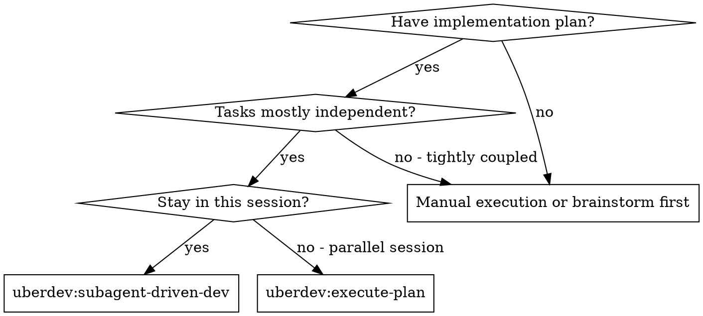
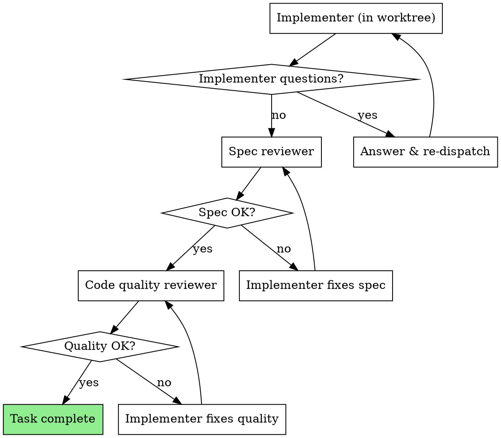

# Subagent-Driven Development

Execute plan **wave-by-wave**. Within each wave, dispatch all implementer subagents **in parallel** inside the same feature-branch worktree, then run two-stage review (spec compliance, then code quality) per task. Move to the next wave only after every task in the current wave is approved and committed.

**Why subagents:** You delegate tasks to specialized agents with isolated context. By precisely crafting their instructions and context, you ensure they stay focused and succeed at their task. They should never inherit your session's context or history — you construct exactly what they need. This also preserves your own context for coordination work.

**Why parallel waves:** Sequential execution of independent tasks wastes wall-clock time. The plan's `## Execution Waves` summary already proves which tasks are safe to run concurrently — honor it.

**Why one shared worktree (Pattern B):** Per-agent worktrees add filesystem ceremony and a merge step. Instead, the wave's implementers all work in the feature-branch worktree on **strictly disjoint file sets** (enforced by the plan's `Worktree-safe:` declarations). To prevent git-index races, **implementers never run git** — they edit files and report changed paths; the controller stages and commits per task in a deterministic order after the wave finishes.

**Core principle:** Parallel-by-default within a wave + disjoint file sets + controller-only git = maximum throughput, zero races.

## Isolation: always use worktrees for parallel writes

When dispatching agents in parallel that may write to overlapping files, set `isolation: "worktree"` on each Agent tool call. Claude Code creates a temporary git worktree per agent so writes happen on isolated branches and merge back without races.

**Example dispatch:**
```
Agent({
  description: "Implement feature X",
  subagent_type: "general-purpose",
  isolation: "worktree",
  prompt: "..."
})
```

**When to skip:** if your batches are partitioned so no two agents touch the same file (verified by listing target paths up front), worktrees add overhead without benefit. Default to isolation; opt out only when partitioning is provable. **This skill's Pattern B is exactly that opt-out** — every wave's allowlist/denylist makes file-set disjointness provable, and the controller (not the agents) runs git, so isolation would be wasted ceremony here. For any **other** parallel dispatch (review fanouts, ad-hoc multi-agent edits, brainstorm spikes), default to `isolation: "worktree"`.

**Why:** prevents concurrent-write races, especially in code-edit waves where multiple agents may converge on shared files (e.g., a shared types file, a config root). Worktrees auto-clean if the agent makes no changes.

## When to Use



**vs. uberdev:execute-plan (parallel session):**
- Same session (no context switch)
- Fresh subagent per task (no context pollution)
- Two-stage review after each task: spec compliance first, then code quality
- Faster iteration (no human-in-loop between tasks)

## The Process

### High-Level Flow

1. **Read plan once.** Extract every task's full text and the `## Execution Waves` summary.
2. **Create TodoWrite** with one todo per task, labeled with its wave (e.g., `[wave-2] Task 4: ...`).
3. **Verify clean baseline:** `git status` is clean; you're on the feature branch in the feature-branch worktree.
4. **For each wave (sequential):**
   a. Dispatch every implementer in the wave **in a single message** with multiple `Agent` tool calls. All run in the current worktree. Each implementer gets an explicit allowlist of files it owns and an explicit denylist of files owned by sibling tasks.
   b. **Implementers never run git.** They edit files, run their tests, and report `Status + changed file paths + test results`.
   c. Wait for all wave implementers to report.
   d. For each completed implementer (in task ID order, sequential): controller stages **only that task's reported paths** with `git add <paths>` and commits with the task-specific message.
   e. Run the project's full test command in the worktree once after all wave commits land. If it fails, identify which task regressed and re-dispatch that task's implementer with the failure context. Re-test until green.
   f. For each committed task: dispatch spec reviewer (parallel across the wave).
   g. Loop spec fix-up per task until all spec reviewers approve. Fix dispatches still don't run git — controller amends the task's commit (or creates a fix-up commit) using the implementer's reported new paths.
   h. Dispatch code quality reviewers (parallel). Same fix-loop pattern.
   i. Mark every task in the wave complete in TodoWrite.
5. After the final wave, dispatch the **whole-implementation final reviewer**.
6. Hand off to `uberdev:finish-branch`.

### Parallel Dispatch Pattern

```
[wave-1] →  Agent(T1, edits files only)  ┐
            Agent(T2, edits files only)  ├─ all in ONE message, shared CWD
            Agent(T3, edits files only)  ┘
                ↓ wait for all three
            controller: git add <T1 paths> && git commit  (sequential, deterministic)
            controller: git add <T2 paths> && git commit
            controller: git add <T3 paths> && git commit
            controller: run full test suite
                ↓
            spec reviewers (parallel) → fix loop → re-reviews
            quality reviewers (parallel) → fix loop → re-reviews
                ↓ no merge step — already on feature branch
[wave-2] →  Agent(T4, edits files only)  ┐
            Agent(T5, edits files only)  ┘  (parallel, depend on wave-1 commits)
            ...
```

### File-Ownership Enforcement

Before dispatching a wave, build the wave's ownership map:

```
T2 owns: src/recovery.ts, tests/recovery.test.ts
T3 owns: src/progress.ts, tests/progress.test.ts
T4 owns: src/telemetry.ts, tests/telemetry.test.ts
```

Every implementer prompt receives **its own allowlist + the union of sibling-owned paths as a denylist**. If two tasks claim the same file, the wave decomposition is wrong — bump one to the next wave before dispatching.

### Per-Task Inner Loop (unchanged)



## Model Selection

Use the least powerful model that can handle each role to conserve cost and increase speed.

**Mechanical implementation tasks** (isolated functions, clear specs, 1-2 files): use a fast, cheap model. Most implementation tasks are mechanical when the plan is well-specified.

**Integration and judgment tasks** (multi-file coordination, pattern matching, debugging): use a standard model.

**Architecture, design, and review tasks**: use the most capable available model.

**Task complexity signals:**
- Touches 1-2 files with a complete spec → cheap model
- Touches multiple files with integration concerns → standard model
- Requires design judgment or broad codebase understanding → most capable model

## Handling Implementer Status

Implementer subagents report one of four statuses. Handle each appropriately:

**DONE:** Proceed to spec compliance review.

**DONE_WITH_CONCERNS:** The implementer completed the work but flagged doubts. Read the concerns before proceeding. If the concerns are about correctness or scope, address them before review. If they're observations (e.g., "this file is getting large"), note them and proceed to review.

**NEEDS_CONTEXT:** The implementer needs information that wasn't provided. Provide the missing context and re-dispatch.

**BLOCKED:** The implementer cannot complete the task. Assess the blocker:
1. If it's a context problem, provide more context and re-dispatch with the same model
2. If the task requires more reasoning, re-dispatch with a more capable model
3. If the task is too large, break it into smaller pieces
4. If the plan itself is wrong, escalate to the human

**Never** ignore an escalation or force the same model to retry without changes. If the implementer said it's stuck, something needs to change.

## Prompt Templates

- `./implementer-prompt.md` - Dispatch implementer subagent
- `./spec-reviewer-prompt.md` - Dispatch spec compliance reviewer subagent
- `./code-quality-reviewer-prompt.md` - Dispatch code quality reviewer subagent

## Example Workflow

```
You: I'm using Subagent-Driven Development to execute this plan.

[Read plan file once: docs/uberdev/plans/feature-plan.md]
[Extract all 5 tasks + Execution Waves summary:
   wave-1: T1 (schema)
   wave-2: T2, T3, T4 (parallel — different files)
   wave-3: T5 (depends on T2,T3,T4)
]
[Create TodoWrite labeled by wave]

=== WAVE 1 ===

Task 1: Hook installation script (alone in wave-1)
T1 owns: scripts/install-hook.sh, tests/install-hook.test.sh

[Dispatch implementer in shared worktree, full task text + allowlist + "no git commands"]

Implementer: "Before I begin - should the hook be installed at user or system level?"

You: "User level (~/.config/uberdev/hooks/)"

Implementer: "Got it. Implementing now..."
[Later] Implementer:
  - Edited scripts/install-hook.sh, tests/install-hook.test.sh
  - Tests 5/5 passing
  - Self-review: Found I missed --force flag, added it
  - Status: DONE — paths: [scripts/install-hook.sh, tests/install-hook.test.sh]

[Controller: git add scripts/install-hook.sh tests/install-hook.test.sh && git commit -m "feat: install-hook script"]
[Run full test suite — green]

[Dispatch spec compliance reviewer]
Spec reviewer: ✅ Spec compliant - all requirements met, nothing extra

[Dispatch code quality reviewer]
Code reviewer: Strengths: Good test coverage, clean. Issues: None. Approved.

[Mark Task 1 complete]

=== WAVE 2 ===

Ownership map:
  T2 owns: src/recovery.ts, tests/recovery.test.ts
  T3 owns: src/progress.ts, tests/progress.test.ts
  T4 owns: src/telemetry.ts, tests/telemetry.test.ts

[Single message, three Agent calls in parallel — same shared worktree, no git permitted]
  Agent(T2: Recovery modes,    allow=[T2 paths], deny=[T3+T4 paths])
  Agent(T3: Progress reporting, allow=[T3 paths], deny=[T2+T4 paths])
  Agent(T4: Telemetry hooks,    allow=[T4 paths], deny=[T2+T3 paths])

[Wait for all three implementers to report back with their changed paths]

[Controller, sequential — one commit per task in task ID order]
  git add <T2 paths> && git commit -m "feat: recovery modes"
  git add <T3 paths> && git commit -m "feat: progress reporting"
  git add <T4 paths> && git commit -m "feat: telemetry hooks"

[Run full test suite — green]

[Single message: spec reviewers for T2, T3, T4 in parallel]
[Loop: any failed spec review → re-dispatch that task's implementer (no git); controller amends or fix-up commits using reported paths; re-review until ✅]

[Single message: code quality reviewers for T2, T3, T4 in parallel]
[Loop: any failed quality review → same fix pattern → re-review until ✅]

[Mark Tasks 2, 3, 4 complete]

=== WAVE 3 ===

[T5 alone — depends on wave-2 commits being on the branch]
[Dispatch implementer in shared worktree]
[Controller commits → run full suite → spec review → fix loop → quality review → fix loop → mark complete]

=== FINAL PASS ===

[Dispatch whole-implementation final reviewer]
Final reviewer: All requirements met, ready to merge.

[Hand off to uberdev:finish-branch]
```

## Advantages

**vs. Manual execution:**
- Subagents follow TDD naturally
- Fresh context per task (no confusion)
- Parallel-safe (subagents don't interfere)
- Subagent can ask questions (before AND during work)

**vs. uberdev:execute-plan:**
- Same session (no handoff)
- Continuous progress (no waiting)
- Review checkpoints automatic

**Efficiency gains:**
- No file reading overhead (controller provides full text)
- Controller curates exactly what context is needed
- Subagent gets complete information upfront
- Questions surfaced before work begins (not after)

**Quality gates:**
- Self-review catches issues before handoff
- Two-stage review: spec compliance, then code quality
- Review loops ensure fixes actually work
- Spec compliance prevents over/under-building
- Code quality ensures implementation is well-built

**Cost:**
- More subagent invocations (implementer + 2 reviewers per task)
- Controller does more prep work (extracting all tasks upfront)
- Review loops add iterations
- But catches issues early (cheaper than debugging later)

## Red Flags

**Never:**
- Start implementation on main/master branch without explicit user consent
- Skip reviews (spec compliance OR code quality)
- Proceed with unfixed issues
- Dispatch multiple implementers **without explicit file allowlists/denylists** — they will trample each other's edits
- Let implementer subagents run **any** git command (`add`, `commit`, `stash`, `restore`) — that's the controller's job
- Use `git add -A` or `git add .` to stage a task's commit — always pass the implementer's reported paths explicitly
- Dispatch implementers from **different waves** in parallel — wave-N depends on wave-(N-1) being committed first
- Skip the post-wave full-test-suite run — without it, a regression introduced by parallel edits hides until much later
- Run tasks sequentially when the plan declares them in the same wave (defeats the whole point)
- Make subagent read plan file (provide full text instead)
- Skip scene-setting context (subagent needs to understand where task fits)
- Ignore subagent questions (answer before letting them proceed)
- Accept "close enough" on spec compliance (spec reviewer found issues = not done)
- Skip review loops (reviewer found issues = implementer fixes = review again)
- Let implementer self-review replace actual review (both are needed)
- **Start code quality review before spec compliance is ✅** (wrong order)
- Move to next task while either review has open issues

**If subagent asks questions:**
- Answer clearly and completely
- Provide additional context if needed
- Don't rush them into implementation

**If reviewer finds issues:**
- Implementer (same subagent) fixes them
- Reviewer reviews again
- Repeat until approved
- Don't skip the re-review

**If subagent fails task:**
- Dispatch fix subagent with specific instructions
- Don't try to fix manually (context pollution)

## Integration

**Required workflow setup (run before this skill):**
- **Isolated worktree** — `git worktree add .worktrees/<feature-name> -b <branch-name>` (verify `.worktrees/` is in `.gitignore`; add and commit if not). Run the project's setup command (`npm install` / `cargo build` / `pip install -r requirements.txt` / `go mod download`) and the project's test command to verify a clean baseline before starting.

**Related skills:**
- **`uberdev:write-plan`** — creates the plan this skill executes
- **`uberdev:execute-plan`** — alternative for parallel-session/inline execution

**Subagents follow TDD discipline within each task:** write a minimal failing test for the new behavior FIRST, run it to see it fail for the expected reason, write the simplest code that makes it pass, run again to see green, then refactor while green. The implementer-prompt.md template enforces this; the spec and code-quality reviewers verify it was actually applied.

**Code review dispatch:** the code-quality reviewer in this skill dispatches the bundled `uberdev:code-reviewer` agent (see `plugins/uberdev/agents/code-reviewer.md`) — no separate "requesting-code-review" skill is needed, the agent's own prompt encapsulates the review template.

**Finishing the development branch:** after all tasks pass review and the final-pass code review approves, invoke `uberdev:finish-branch` to verify tests, present the 4-option close-out (merge / PR / keep / discard), execute the chosen one, and clean up the worktree.
