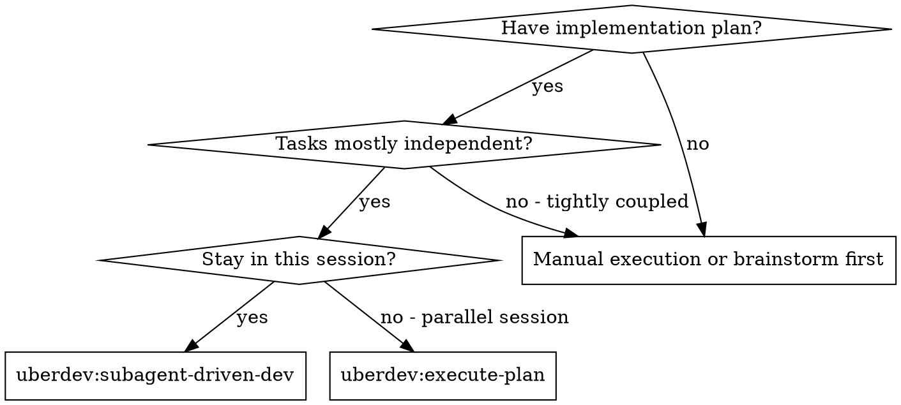
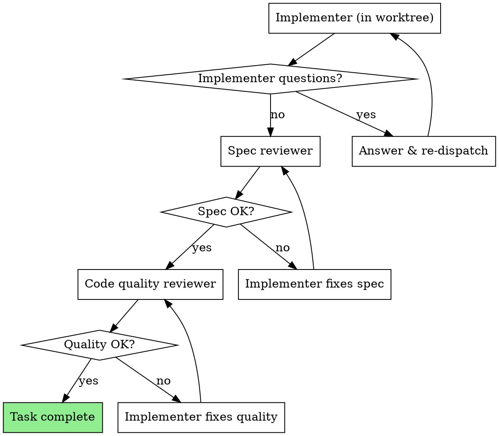

<!-- Vendored from obra/superpowers@e7a2d16476bf042e9add4699c9d018a90f86e4a6 (MIT) — see plugins/uberdev/licenses/superpowers-MIT.txt — the base this component was copied from and the SHA vendor.json records for it; stance is `fork`, so the local bytes diverge deliberately — see this component's stance_reason. -->

# Subagent-Driven Development

Execute plan **wave-by-wave**. Within each wave, dispatch all implementer subagents **in parallel** inside the same feature-branch worktree, then run two-stage review (spec compliance, then code quality) per task. Move to the next wave only after every task in the current wave is approved and committed.

**Why subagents:** You delegate tasks to specialized agents with isolated context. By precisely crafting their instructions and context, you ensure they stay focused and succeed at their task. They should never inherit your session's context or history — you construct exactly what they need. This also preserves your own context for coordination work.

**Why parallel waves:** Sequential execution of independent tasks wastes wall-clock time. The plan's `## Execution Waves` summary already proves which tasks are safe to run concurrently — honor it.

**Why one shared worktree (Pattern B):** Per-agent worktrees add filesystem ceremony and a merge step. Instead, the wave's implementers all work in the feature-branch worktree on **strictly disjoint file sets**. That partition is *declared* by the plan — each task's `Owns (file allowlist)` field plus the plan's `## Execution Waves` summary — *reviewed* by `plan-reviewer` Check 2 (same-wave `Owns` lists must be strictly disjoint; any file in two of them is a critical finding), and *refused at dispatch* by `sdd_assert_wave_disjoint`, which `sdd_launch_prepared_batch` calls before it dispatches anything. To prevent git-index races, **implementers never run git** — they edit files and report changed paths; the controller stages and commits per task in a deterministic order after the wave finishes.

**Core principle:** Parallel-by-default within a wave + disjoint file sets + controller-only git = maximum throughput, zero races.

**Which lane this is.** Everything above describes the **session lane** — a session holds the `Agent` tool and can fan out, so waves of parallel implementers over strictly disjoint file sets are its contract. The **Workflow lane** (`skills/solve-fleet/workflow.js`) is **sequential** per task instead: a Workflow agent has no `Agent`/`Task` tool and cannot fan out (RFC 0020 §1, resting on RFC 0015 §4.1), so it runs implementer → reviewer → bounded fix ladder one task at a time (#508). Parallel-by-default is this skill's core principle — the session lane's — not a universal truth, and the three sentences above are narrowed by this clause rather than retracted by it.

## Inputs

When invoked from `orchestrator/SKILL.md` Phase 5, this skill accepts:

- `plan_path` (required, absolute) — the implementation plan to execute.
- `spec_path` (optional, absolute) — the design spec the plan was derived from. Required to enable the Step 4.5 pre-merge `pr-test-analyzer` dispatch (the analyzer reads acceptance criteria verbatim from this file).
- `summary_dir` (optional, absolute, trailing slash) — the orchestrator's `$RESEARCH_DIR_ABS/`. Required to enable the Step 4.5 pre-merge `pr-test-analyzer` dispatch.
- `tier` (optional, one of `trivial`/`small`/`medium`) — used to gate Step 4.5. Only `medium` runs the dispatch; all other tiers skip silently. The gate named `large` until #619 deleted that rung; it moved to `medium` with it rather than being left unreachable, so the pre-merge test review still runs on every issue that used to reach it.

Inputs other than `plan_path` are additive and backward-compatible: pre-#92 manual SDD invocations continue to work unchanged (Step 4.5 is a no-op when `spec_path`, `summary_dir`, or `tier` is absent).

## Loop caps

Every retry loop in this skill is bounded. The caps are named constants, and this skill is their canonical owner: `lib/turbox-fleet.sh`, `skills/turbox-fleet/SKILL.md`, `skills/solve-fleet/workflow.js` and `skills/solve-fleet/SKILL.md` all carry derived copies, bound numerically to `sdd_loop_cap` by `tests/sdd-wave-contract.test.sh` §C. (The `sdd-waves` workflow this sentence once forward-referenced will not be built — RFC 0020 §1; the retraction is recorded in RFC 0012 §3.6.) This capped directive loop is retained permanently as the non-Workflow fallback path (Gemini / Copilot / pre-Workflow harnesses execute it directly):

- **`fix_rounds` = 3** — per task, per review stage (spec compliance OR code quality): at most 3 review → fix → re-review iterations. On exhaustion, treat the task as BLOCKED (see "Handling Implementer Status") — never keep looping.
- **`retest_rounds` = 2** — per wave: at most 2 regression-attribution re-dispatches of a suspected implementer after a red full-suite run. On exhaustion, halt the wave with committed work intact and escalate.
- **`context_rounds` = 2** — per task: at most 2 NEEDS_CONTEXT answer-and-re-dispatch cycles. Overflow routes into the same BLOCKED ladder — a task still lacking context after 2 supplements has a plan problem, not a context problem.

Cap exhaustion is never silent: report which cap fired and route through the BLOCKED ladder rather than accepting unreviewed work or looping unboundedly.

The caps are not prose the controller is asked to remember. `sdd_loop_cap <name>` is the single numeric source, and `sdd_round_permitted <loop> <round>` is the guard every fix-shaped loop calls before minting the next instance id: rc `0` proceed, rc `3` cap exhausted (route BLOCKED), rc `2` you called it wrong.

## Fix ledger

Every fix-shaped re-dispatch has to carry what the previous round learned. This skill cannot resume a child — instance IDs are allocation identities and are never reused, and results are immutable — so continuity travels on disk, in one append-only **fix ledger per task**.

- **Where.** In the controller's private run directory, the same directory that already holds that task's `task_path`. Never inside the feature worktree: an untracked file there is exactly what `git add -A` (already a Red Flag) would sweep into a task commit, and it perturbs the post-wave full-test-suite run. The handoff validator only accepts an absolute artifact path confined to the run directory or the repository, so a ledger anywhere else is rejected as out of scope.
- **How it is written.** Created on the first append at mode `0600` by `sdd_append_fix_ledger <ledger> <round> <loop> <stage> <source_instance> <task_brief> <prior_result> <findings_path>`, appended by every later round, never truncated and never rewritten. `sdd_note_cap_exhausted <ledger> <loop> <round>` writes the final entry when a cap fires.
- **Who may read it.** The ledger is **not** in `allowed_paths` and **not** in `denied_paths`, so the implementer may read it and must not write it — see `./implementer-prompt.md`, "Files outside both lists: read-only".
- **How it travels.** It rides as `failure_path` on **every** non-first `sdd.task.implement` dispatch for that task: the step-4e regression retest, the `spec-fix` rounds, the `quality-fix` rounds, and every NEEDS_CONTEXT re-dispatch. The first `implement` attempt still passes `""`.
- **What an entry holds.** The round, the loop that governs it, the stage, the source reviewer/test instance id, the absolute task brief path, the absolute prior implementer result path, and the reviewer findings verbatim. The implementer of round N therefore opens one file and sees rounds 1..N instead of re-deriving context the reviewer already priced in.

The append happens **before** the dispatch, because the handoff validator requires a non-empty absolute artifact path to already exist as a regular file.

## Isolation: Pattern B is the opt-out

This skill's wave-based controller-only-git approach is intentionally **not** worktree-isolated — it relies on provable file-set partitioning per wave. For any *other* parallel-agent dispatch (review fanouts, ad-hoc multi-agent edits), default to `isolation: "worktree"` on the Agent tool calls — see the `uberdev:dispatching-parallel-agents` skill.

## Rulings

A run of this skill never parks on a judgement call. `--turbo` is unattended by contract and `/goal` drives its own circuit breakers, so a controller that halts to consult a person is halting in front of an empty chair: nobody is reading. A call that turns out wrong costs rework a reviewer can see and undo; a parked run costs the whole run.

**This adds no new stop.** The stops are the ones this skill already ships — the BLOCKED ladder in "Handling Implementer Status", the REFUSED rung beside it, and cap exhaustion (`## Loop caps`) — and every one of them *routes* rather than waits: it fixes the plan, re-scopes the task, or escalates with committed work intact. An irreversible or destructive operation, a security-sensitive action, a side effect outside the worktree, and a plan too broken to guess at are each covered by that ladder already, so none of them needs a gate of its own here.

What is new is the record. A judgement the controller makes instead of stalling on it is a **ruling**, and every ruling gets one line on disk at the moment it is made:

- **Where.** One append-only `rulings.md` per run, in the controller's private run directory — the same directory that holds each task's `task_path` and fix ledger. Never inside the feature worktree, for the reason `## Fix ledger` already gives: an untracked file there is exactly what `git add -A` sweeps into a task commit, and it perturbs the post-wave full-test-suite run.
- **How.** `sdd_append_ruling "$SDD_RULINGS" <decision> <why> <cost>` creates the file at mode `0600` on the first call and appends one line per call after it, never truncating and never rewriting. `SDD_RULINGS` is established once, in the routed-adapter fence above, and is the only path any call site passes — the helper refuses a relative one, so a run that never set it cannot record a ruling at all.
- **Shape.** `Ruling: <decision> — <why> — <cost>`: what you decided, why you decided it, and what it costs if it turns out to be wrong. All three fields are required, and each must be **one line** — an embedded newline or carriage return would split one ruling into two rows in a file step 5 reads back line by line. Both refusals return rc `2` rather than writing a half-line or a silently reflowed one, exactly as the fix-ledger helpers do.
- **A decision not on disk was not made.** Rulings are no more prose the controller is asked to remember than the caps are: the file is the record, and step 5 reads it back rather than reconstructing it from memory.

What counts as a ruling: overriding a step of the plan, choosing between two defensible approaches, parking a finding once a cap fires, resequencing a wave, or accepting a finding as out of scope for this run. Each of those has a named call site in `## The Process` and in `## Handling Implementer Status` below — the record is written by the step that makes the call, not reconstructed at the end of the run.

## When to Use

## Routed child adapter (mandatory)

<!-- BEGIN child-callsite-contracts-v1 -->
```json
{
  "sdd.task.implement":{"inputs":["task_path","working_dir","allowed_paths","denied_paths","failure_path","attempt"],"optional_inputs":[],"allowed_workflows":["solve","turbo"],"risk_scope":"subtask","risk_argument":"subtask"},
  "sdd.task.spec_review":{"inputs":["spec_path","plan_path","commit_sha","allowed_paths","report_path"],"optional_inputs":[],"allowed_workflows":["solve","turbo"],"risk_scope":"subtask","risk_argument":"subtask"},
  "sdd.task.quality_review":{"inputs":["plan_path","base_sha","head_sha","allowed_paths","report_path"],"optional_inputs":[],"allowed_workflows":["solve","turbo"],"risk_scope":"subtask","risk_argument":"subtask"},
  "sdd.premerge.test_review":{"inputs":["commit_range_path","spec_path","plan_path","acceptance_path","summary_path"],"optional_inputs":[],"allowed_workflows":["solve","turbo"],"risk_scope":"subtask","risk_argument":"subtask"}
}
```
<!-- END child-callsite-contracts-v1 -->

All provider execution in this skill goes through `lib/child-dispatch.sh`.
Before the first wave, source the adapter and capture the immutable root risks:

```bash
. "${CLAUDE_PLUGIN_ROOT}/lib/child-dispatch.sh"
SDD_ROOT_REQUEST_JSON="${UBERDEV_AGENT_PREPARED_REQUEST_JSON:?missing routed root request}"
SDD_WORKTREE="$(git rev-parse --show-toplevel)"
SDD_RISK_JSON="$(python3 -I -B -c 'import json,sys; r=json.loads(sys.argv[1]); print(json.dumps(r.get("root_decision",{}).get("risk_signals",r.get("risk_signals",[])),separators=(",",":")),end="")' "$SDD_ROOT_REQUEST_JSON")"
SDD_CHILD_TIMEOUT="${SDD_CHILD_TIMEOUT:-600}"
case "$SDD_CHILD_TIMEOUT" in ''|*[!0-9]*|0) return 2 ;; esac
SDD_RUN_DIR="$(_uberdev_child_context_run_dir "$(python3 -I -B -c 'import json,sys; print(json.loads(sys.argv[1])["context_file"],end="")' "$SDD_ROOT_REQUEST_JSON")")" || return 2
case "$SDD_RUN_DIR" in /*) ;; *) return 2 ;; esac
SDD_RULINGS="$SDD_RUN_DIR/rulings.md"
```

`SDD_RULINGS` is the run's one rulings file, and establishing it here is what
makes `## Rulings` executable: `sdd_append_ruling` refuses a relative path, and
until this line nothing produced an absolute one. The run directory is derived
by `_uberdev_child_context_run_dir` — the same helper `lib/child-dispatch.sh`
uses for its own confinement checks — rather than re-derived from the context
path here, so the skill cannot come to disagree with the library about where a
run lives. That directory is the private one the fix ledgers and every
`task_path` already sit in, never the feature worktree.

The runtime helper validates the registered edge, immutable carrier, instance,
inputs, risks, confinement, and allocation. It atomically creates the private
handoff and exports `UBERDEV_CHILD_HANDOFF`, `UBERDEV_CHILD_RESULT`, and
`UBERDEV_CHILD_STATUS`; callers never compute or write those paths.

Instance IDs are allocation identities and are never reused:

`sdd-p<PLANSCOPE>-w<WAVE>-t<TASK>-<STAGE>-a<ATTEMPT>`

where stage is one of `implement`, `spec-review`, `spec-fix`, `quality-review`,
`quality-fix`, or `test-review`. Plan scope, wave, task, stage, and attempt are
explicit dynamic dimensions. Plan scope is the **execution-scope** dimension:
the run tree is derived from the carrier, so one carrier owns one instance-ID
namespace for every plan it executes, while the plan-internal coordinates
(wave, task, stage, attempt) restart at `w1-t1-…-a1` for each plan. Without it,
a second plan executed under the same carrier — `write_plan.sdd` followed by
`orchestrator.sdd`, both registered entry edges — collides on the first
coordinate it reuses and is refused as `instance_exists`. The scope is minted
by `sdd_plan_scope` as the first 12 hex characters of
`sha256(realpath(plan) ⊕ NUL ⊕ plan bytes)`: the realpath keeps two distinct
but byte-identical plans apart, the bytes keep two same-day plans that share a
basename apart, and 12 hex characters carry no plan-derived free text into a
path. The four stable routing edges are:

| Edge | Role | Gate |
|---|---|---|
| `sdd.task.implement` | `implementation-worker` | required |
| `sdd.task.spec_review` | `spec-compliance-reviewer` | required |
| `sdd.task.quality_review` | `code-reviewer` | required |
| `sdd.premerge.test_review` | `pr-test-analyzer` | advisory; `medium` tier only |

Before any helper call, validate all instance dimensions and canonicalize the
task ownership lists. Ownership paths arrive repo-relative, but child inputs
carry absolute canonical paths confined under the current worktree. Existing
symlink ancestors are resolved before the confinement check; absolute inputs,
empty paths, escapes, and allow/deny overlap are rejected.

```bash
sdd_validate_instance_dimensions() {
  local wave="${@:1:1}" task="${@:2:1}" stage="${@:3:1}" attempt="${@:4:1}" plan_scope="${@:5:1}"
  [ "$#" -ge 5 ] || return 2
  sdd_validate_positive_decimal "$wave" || return 2
  sdd_validate_positive_decimal "$task" || return 2
  sdd_validate_positive_decimal "$attempt" || return 2
  case "$stage" in implement|spec-review|spec-fix|quality-review|quality-fix|test-review) ;; *) return 2 ;; esac
  sdd_validate_plan_scope "$plan_scope" || return 2
}

sdd_validate_positive_decimal() {
  [ "$#" -ge 1 ] || return 2
  case "${@:1:1}" in
    ''|*[!0-9]*) return 2 ;;
    *[1-9]*) return 0 ;;
    *) return 2 ;;
  esac
}

# The single numeric source for the "## Loop caps" section — and the only one.
# The cap NAMES are this function's argument vocabulary; every other surface
# in the repo carries a derived copy, and tests/sdd-wave-contract.test.sh §C
# asserts each of them numerically against this function rather than trusting
# a comment. A comment is not a producer (RFC 0016:60); that test is.
sdd_loop_cap() {
  [ "$#" -ge 1 ] || return 2
  case "${@:1:1}" in
    fix_rounds) printf '%s' 3 ;;
    retest_rounds) printf '%s' 2 ;;
    context_rounds) printf '%s' 2 ;;
    *) return 2 ;;
  esac
}

sdd_validate_plan_scope() {
  [ "$#" -ge 1 ] || return 2
  case "${@:1:1}" in
    [0-9a-f][0-9a-f][0-9a-f][0-9a-f][0-9a-f][0-9a-f][0-9a-f][0-9a-f][0-9a-f][0-9a-f][0-9a-f][0-9a-f]) return 0 ;;
    *) return 2 ;;
  esac
}

# The breaker. rc 3 (exhausted) is deliberately distinct from the repo-wide
# validation rc 2, so a caller can tell "cap fired, route BLOCKED" from "you
# called me wrong". The round is normalized base 10 through this fence's own
# sdd_json_decimal_integer, the same normalizer `attempt` goes through: a raw
# `[ 010 -le <cap> ]` reads 010 as octal 8 in both shells, so the fence would
# carry two disagreeing arithmetics for the same round number.
sdd_round_permitted() {
  [ "$#" -ge 2 ] || return 2
  local loop="${@:1:1}" round="${@:2:1}"
  local cap normalized
  cap="$(sdd_loop_cap "$loop")" || return 2
  sdd_validate_positive_decimal "$round" || return 2
  normalized="$(sdd_json_decimal_integer "$round")" || return 2
  [ "$normalized" -le "$cap" ] || return 3
}

# The continuity carrier. One append-only ledger per task, in the private run
# directory that already holds that task's task_path; O_APPEND creates it at
# 0600 on the first round and appends thereafter, O_NOFOLLOW refuses a symlink,
# and O_WRONLY on a directory is EISDIR. It is never truncated and never
# rewritten.
sdd_append_fix_ledger() {
  [ "$#" -eq 8 ] || return 2
  local ledger="${@:1:1}" round="${@:2:1}" loop="${@:3:1}" stage="${@:4:1}"
  local source_instance="${@:5:1}" task_brief="${@:6:1}" prior_result="${@:7:1}"
  local findings_file="${@:8:1}"
  sdd_validate_positive_decimal "$round" || return 2
  sdd_loop_cap "$loop" >/dev/null || return 2
  # Stage is checked against the ONE accepted-stage set, never a second copy of
  # it; the wave/task/attempt arguments here are placeholders the validator
  # already accepts.
  #
  # The plan scope is a placeholder for the same reason (#458 gave the
  # validator a fifth dimension). A ledger entry is scoped to a TASK, not to a
  # plan, so this call has no real scope to pass — and passing four arguments
  # to a five-argument validator makes it refuse on ARITY, which reads exactly
  # like "the stage is unregistered" and rejected every legitimate stage.
  local placeholder_scope=000000000000
  sdd_validate_instance_dimensions 1 1 "$stage" 1 "$placeholder_scope" || return 2
  [ -n "$source_instance" ] || return 2
  case "$ledger" in /*) ;; *) return 2 ;; esac
  case "$task_brief" in /*) ;; *) return 2 ;; esac
  case "$prior_result" in /*) ;; *) return 2 ;; esac
  case "$findings_file" in /*) ;; *) return 2 ;; esac
  python3 -I -B - "$ledger" "$round" "$loop" "$stage" "$source_instance" \
    "$task_brief" "$prior_result" "$findings_file" <<'PY' || return 2
import os,sys
ledger,round_no,loop,stage,source_instance,task_brief,prior_result,findings=sys.argv[1:]
with open(findings,'rb') as handle: body=handle.read()
if not body.endswith(b"\n"): body+=b"\n"
head=("## round %s | loop %s | stage %s\n"
      "source_instance: %s\n"
      "task_brief: %s\n"
      "prior_result: %s\n"
      "findings:\n" % (round_no,loop,stage,source_instance,task_brief,prior_result)).encode("utf-8")
fd=os.open(ledger,os.O_WRONLY|os.O_CREAT|os.O_APPEND|os.O_NOFOLLOW,0o600)
with os.fdopen(fd,"ab") as stream: stream.write(head+body)
PY
}

# "Cap exhaustion is never silent" becomes bytes on disk: the last entry the
# ledger carries before the task enters the BLOCKED ladder.
sdd_note_cap_exhausted() {
  [ "$#" -eq 3 ] || return 2
  local ledger="${@:1:1}" loop="${@:2:1}" round="${@:3:1}"
  local cap
  cap="$(sdd_loop_cap "$loop")" || return 2
  sdd_validate_positive_decimal "$round" || return 2
  case "$ledger" in /*) ;; *) return 2 ;; esac
  python3 -I -B - "$ledger" "$loop" "$round" "$cap" <<'PY' || return 2
import os,sys
ledger,loop,round_no,cap=sys.argv[1:]
entry=("## cap exhausted | loop %s | round %s | cap %s\n" % (loop,round_no,cap)).encode("utf-8")
fd=os.open(ledger,os.O_WRONLY|os.O_CREAT|os.O_APPEND|os.O_NOFOLLOW,0o600)
with os.fdopen(fd,"ab") as stream: stream.write(entry)
PY
}

# A decision not on disk was not made. One append-only `rulings.md` per run,
# living beside the fix ledgers in the controller's private run directory and
# never inside the feature worktree — the worktree is what `git add -A` sweeps
# into the branch. O_APPEND creates it at 0600 on the first ruling and appends
# thereafter, O_NOFOLLOW refuses a symlink, and O_WRONLY on a directory is
# EISDIR. One line per call, never truncated and never rewritten, so the
# end-of-run roll-up is read back from the file instead of remembered.
sdd_append_ruling() {
  [ "$#" -eq 4 ] || return 2
  local rulings_path="${@:1:1}" decision="${@:2:1}" why="${@:3:1}" cost="${@:4:1}"
  case "$rulings_path" in /*) ;; *) return 2 ;; esac
  [ -n "$decision" ] || return 2
  [ -n "$why" ] || return 2
  [ -n "$cost" ] || return 2
  # The one-line guard lives beside the format string it protects, below.
  python3 -I -B - "$rulings_path" "$decision" "$why" "$cost" <<'PY' || return 2
import os,sys
rulings,decision,why,cost=sys.argv[1:]
# One line per call is the whole contract: step 5 reads this file back by LINE
# and pushes each one into the PR body. A newline inside a field would split one
# ruling into two rows -- the second with no decision, no why and no cost and
# nothing marking it as half of one -- and a carriage return does the same to
# any reader that splits on CRLF. Refused with the same rc 2 an empty field
# draws, never stripped: stripping rewrites the decision instead of rejecting
# it, and a silently rewritten ruling is worse than a missing one.
for field in (decision,why,cost):
    if "\n" in field or "\r" in field:
        print('uberdev sdd: ruling_field_not_one_line',file=sys.stderr); raise SystemExit(2)
entry=("Ruling: %s — %s — %s\n" % (decision,why,cost)).encode("utf-8")
fd=os.open(rulings,os.O_WRONLY|os.O_CREAT|os.O_APPEND|os.O_NOFOLLOW,0o600)
with os.fdopen(fd,"ab") as stream: stream.write(entry)
PY
}

sdd_plan_scope() {
  [ "$#" -ge 1 ] || return 2
  python3 -I -B - "${@:1:1}" <<'PY'
import hashlib,os,sys
plan=sys.argv[1]
if not plan or not os.path.isabs(plan):
    print('uberdev sdd: plan_scope_path_not_absolute',file=sys.stderr); raise SystemExit(2)
real=os.path.realpath(plan)
try:
    with open(real,'rb') as stream: body=stream.read()
except OSError as error:
    print(f'uberdev sdd: plan_scope_unreadable errno={error.errno}',file=sys.stderr); raise SystemExit(2)
print(hashlib.sha256(real.encode()+b'\0'+body).hexdigest()[:12],end='')
PY
}

sdd_canonicalize_owned_paths() {
  local inputs_json="${@:1:1}"
  [ "$#" -ge 1 ] || return 2
  python3 -I -B - "$SDD_WORKTREE" "$inputs_json" <<'PY'
import json,os,sys
root=os.path.realpath(sys.argv[1]); value=json.loads(sys.argv[2])
def canon(key):
    if key not in value: return set()
    raw=value.get(key,[])
    if not isinstance(raw,list) or any(not isinstance(p,str) or not p or os.path.isabs(p) for p in raw): raise SystemExit(2)
    out=[]
    for item in raw:
        path=os.path.realpath(os.path.join(root,item))
        if os.path.commonpath((root,path)) != root: raise SystemExit(2)
        out.append(path)
    if len(out)!=len(set(out)): raise SystemExit(2)
    value[key]=out
    return set(out)
allowed=canon("allowed_paths"); denied=canon("denied_paths")
if allowed & denied: raise SystemExit(2)
print(json.dumps(value,sort_keys=True,separators=(",",":")),end="")
PY
}

# The wave's safety precondition, refused rather than assumed. Parallel
# implementers in one shared worktree are only race-free while their ownership
# is strictly disjoint; the plan DECLARES that partition (`Owns (file
# allowlist)` per task) and `plan-reviewer` Check 2 REVIEWS it, but a review is
# advice and a plan defect must not reach a dispatch. This is the chokepoint
# that turns it into a refusal.
#
# Directory containment counts: one task owning `lib/` and a sibling owning
# `lib/x.sh` race exactly as if they shared a path, and a plain set intersection
# calls them disjoint. `under()` mirrors tools/vendor/vendor-drift.py's.
#
# Everything arrives on argv and the heredoc is quoted, so the Skill renderer's
# positional-argument substitution has no bare positional token to corrupt (the
# class tests/skill-renderer-awk-collision.test.sh guards). Paths are already
# canonical absolute realpaths confined to $SDD_WORKTREE
# (sdd_canonicalize_owned_paths runs earlier at the batch callsite), so this
# resolves nothing itself.
sdd_assert_wave_disjoint() {
  [ "${#SDD_PREPARED_IMPLEMENT_PATHS[@]}" -gt 0 ] || return 0
  python3 -I -B - "${SDD_PREPARED_IMPLEMENT_PATHS[@]}" <<'PY'
import json,os,sys
owned=[]
for index,raw in enumerate(sys.argv[1:],1):
    try:
        value=json.loads(raw)
    except ValueError:
        print('uberdev sdd: wave_paths_unreadable task=%d' % index,file=sys.stderr); raise SystemExit(2)
    paths=value.get('allowed_paths') if isinstance(value,dict) else None
    if not isinstance(paths,list) or not paths or any(not isinstance(p,str) or not p for p in paths):
        print('uberdev sdd: wave_paths_missing task=%d' % index,file=sys.stderr); raise SystemExit(2)
    owned.append(paths)
def under(a,b):
    if a==b: return True
    stem=b.rstrip('/\\')
    return a.startswith(stem+'/') or a.startswith(stem+os.sep)
for i in range(len(owned)):
    for j in range(i+1,len(owned)):
        for a in owned[i]:
            for b in owned[j]:
                if under(a,b) or under(b,a):
                    collision=a if under(a,b) else b
                    print('uberdev sdd: wave_paths_overlap task_a=%d task_b=%d path=%s'
                          % (i+1,j+1,collision),file=sys.stderr)
                    raise SystemExit(3)
PY
}

SDD_PREPARED_EDGES=(); SDD_PREPARED_INSTANCES=(); SDD_PREPARED_HANDOFFS=()
SDD_PREPARED_HANDOFF_SHA256S=()
SDD_PREPARED_RESULTS=(); SDD_PREPARED_STATUSES=()
SDD_PREPARED_IMPLEMENT_PATHS=()
SDD_RECEIPT_INSTANCES=(); SDD_RECEIPT_STATUSES=(); SDD_RECEIPT_RESULTS=()
SDD_BATCH_RESULT_INSTANCES=(); SDD_BATCH_RESULT_PATHS=()
sdd_reset_batch() {
  SDD_PREPARED_EDGES=(); SDD_PREPARED_INSTANCES=(); SDD_PREPARED_HANDOFFS=()
  SDD_PREPARED_HANDOFF_SHA256S=()
  SDD_PREPARED_RESULTS=(); SDD_PREPARED_STATUSES=()
  SDD_PREPARED_IMPLEMENT_PATHS=()
  SDD_RECEIPT_INSTANCES=(); SDD_RECEIPT_STATUSES=(); SDD_RECEIPT_RESULTS=()
}
sdd_begin_batch() {
  [ "${#SDD_PREPARED_HANDOFFS[@]}" -eq 0 ] || return 2
  [ "${#SDD_PREPARED_HANDOFF_SHA256S[@]}" -eq 0 ] || return 2
  [ "${#SDD_PREPARED_IMPLEMENT_PATHS[@]}" -eq 0 ] || return 2
  [ "${#SDD_RECEIPT_INSTANCES[@]}" -eq 0 ] || return 2
  [ "${#SDD_RECEIPT_STATUSES[@]}" -eq 0 ] || return 2
  [ "${#SDD_RECEIPT_RESULTS[@]}" -eq 0 ] || return 2
  sdd_reset_batch
}
sdd_unwind_child_receipts() {
  local index child_status result cleanup_rc=0
  for ((index=0; index<${#SDD_RECEIPT_INSTANCES[@]}; index++)); do
    child_status="${SDD_RECEIPT_STATUSES[$index]}"; result="${SDD_RECEIPT_RESULTS[$index]}"
    if ! uberdev_unwind_child "$child_status" "$result" "$SDD_CHILD_TIMEOUT"; then cleanup_rc=1; fi
  done
  sdd_reset_batch
  return "$cleanup_rc"
}

sdd_dispatch_prepared() {
  local edge_id="${@:1:1}" instance_id="${@:2:1}" inputs_json="${@:3:1}" risk_json="${@:4:1}"
  [ "$#" -ge 4 ] || return 2
  local handoff handoff_sha256 result child_status create_rc cleanup_rc
  if uberdev_create_child_handoff "$edge_id" "$instance_id" "$inputs_json" "$risk_json"; then
    :
  else
    create_rc=$?; cleanup_rc=0
    sdd_unwind_child_receipts || cleanup_rc=$?
    [ "$cleanup_rc" -eq 0 ] || echo "error: SDD receipt unwind failed after handoff edge=$edge_id instance=$instance_id" >&2
    return "$create_rc"
  fi
  handoff="$UBERDEV_CHILD_HANDOFF"; handoff_sha256="$UBERDEV_CHILD_HANDOFF_SHA256"
  result="$UBERDEV_CHILD_RESULT"; child_status="$UBERDEV_CHILD_STATUS"
  SDD_PREPARED_EDGES+=("$edge_id"); SDD_PREPARED_INSTANCES+=("$instance_id")
  SDD_PREPARED_HANDOFFS+=("$handoff"); SDD_PREPARED_HANDOFF_SHA256S+=("$handoff_sha256")
  SDD_PREPARED_RESULTS+=("$result")
  SDD_PREPARED_STATUSES+=("$child_status")
  # Only the implement edge writes; reviewers are read-only and deliberately
  # share a scope, so the accumulator the disjointness guard reads is populated
  # by edge id. A plain `if` rather than a `case`/`elif` arm on purpose: an
  # edge-id token vocabulary spelled as a case arm is the shape
  # tests/contract-markers.test.sh scans for, and there is no registered SDD-edge
  # vocabulary to mark this against.
  if [ "$edge_id" = "sdd.task.implement" ]; then
    SDD_PREPARED_IMPLEMENT_PATHS+=("$inputs_json")
  fi
}

# sdd_wait_prepared_batch resets the prepared arrays on every exit path, so the
# per-instance result paths are gone by the time the controller reads a verdict.
# Snapshot them between launch and wait. Deliberately NOT reset by
# sdd_reset_batch and deliberately not part of sdd_begin_batch's emptiness
# preconditions: surviving the reset is the whole point, and the copy is
# wholesale. Whole-array copy rather than an indexed loop, because the fence's
# bash-0-indexed ${ARR[$index]} idiom reads empty under zsh.
sdd_snapshot_batch_results() {
  SDD_BATCH_RESULT_INSTANCES=(); SDD_BATCH_RESULT_PATHS=()
  [ "${#SDD_PREPARED_INSTANCES[@]}" -gt 0 ] || return 2
  [ "${#SDD_PREPARED_INSTANCES[@]}" -eq "${#SDD_PREPARED_RESULTS[@]}" ] || return 2
  SDD_BATCH_RESULT_INSTANCES=("${SDD_PREPARED_INSTANCES[@]}")
  SDD_BATCH_RESULT_PATHS=("${SDD_PREPARED_RESULTS[@]}")
}

sdd_launch_prepared_batch() {
  local index edge instance handoff handoff_sha256 result child_status dispatch_rc cleanup_rc disjoint_rc
  local preflight_refs=()
  [ "${#SDD_PREPARED_HANDOFFS[@]}" -gt 0 ] || return 2
  [ "${#SDD_PREPARED_HANDOFFS[@]}" -eq "${#SDD_PREPARED_HANDOFF_SHA256S[@]}" ] || return 2
  # The position is load-bearing. Refusing here means nothing external is called
  # before a plan defect is rejected, and it is UPSTREAM of the
  # `for ((index=0; …)); ${ARR[$index]}` loops below — which are bash-0-indexed
  # and read empty under zsh (see sdd_snapshot_batch_results) — so the refusal,
  # and only the refusal, is reproducible cross-shell. rc 3 = ownership overlaps
  # (a plan defect; route the wave into the BLOCKED ladder), rc 2 = ownership is
  # absent. Reset on refusal, exactly as the preflight failure arm does.
  sdd_assert_wave_disjoint || { disjoint_rc=$?; sdd_reset_batch; return "$disjoint_rc"; }
  for ((index=0; index<${#SDD_PREPARED_HANDOFFS[@]}; index++)); do
    preflight_refs+=("${SDD_PREPARED_HANDOFFS[$index]}" "${SDD_PREPARED_HANDOFF_SHA256S[$index]}")
  done
  uberdev_preflight_child_batch "${preflight_refs[@]}" || {
    dispatch_rc=$?; sdd_reset_batch; return "$dispatch_rc"
  }
  for ((index=0; index<${#SDD_PREPARED_HANDOFFS[@]}; index++)); do
    edge="${SDD_PREPARED_EDGES[$index]}"; instance="${SDD_PREPARED_INSTANCES[$index]}"
    handoff="${SDD_PREPARED_HANDOFFS[$index]}"; handoff_sha256="${SDD_PREPARED_HANDOFF_SHA256S[$index]}"
    result="${SDD_PREPARED_RESULTS[$index]}"
    child_status="${SDD_PREPARED_STATUSES[$index]}"
    if uberdev_dispatch_child "$edge" "$handoff" "$handoff_sha256" "$result" "$child_status"; then
      SDD_RECEIPT_INSTANCES+=("$instance")
      SDD_RECEIPT_STATUSES+=("$child_status")
      SDD_RECEIPT_RESULTS+=("$result")
    else
      dispatch_rc=$?; cleanup_rc=0
      sdd_unwind_child_receipts || cleanup_rc=$?
      [ "$cleanup_rc" -eq 0 ] || echo "error: bounded SDD unwind failed after edge=$edge instance=$instance" >&2
      return "$dispatch_rc"
    fi
  done
}

sdd_wait_prepared_batch() {
  local timeout="${@:1:1}" index child_status result wait_rc first_rc=0 cleanup_rc=0
  [ "$#" -ge 1 ] || return 2
  case "$timeout" in ''|*[!0-9]*|0) return 2 ;; esac
  [ "${#SDD_RECEIPT_INSTANCES[@]}" -gt 0 ] || return 2
  for ((index=0; index<${#SDD_RECEIPT_INSTANCES[@]}; index++)); do
    child_status="${SDD_RECEIPT_STATUSES[$index]}"; result="${SDD_RECEIPT_RESULTS[$index]}"
    if uberdev_wait_child "$child_status" "$result" "$timeout"; then
      continue
    else
      wait_rc=$?
    fi
    [ "$first_rc" -ne 0 ] || first_rc="$wait_rc"
    if ! uberdev_unwind_child "$child_status" "$result" "$timeout"; then cleanup_rc=1; fi
  done
  sdd_reset_batch
  if [ "$first_rc" -ne 0 ]; then
    [ "$cleanup_rc" -eq 0 ] || echo "error: bounded SDD unwind failed after child wait" >&2
    return "$first_rc"
  fi
  return 0
}

sdd_json_string() {
  [ "$#" -eq 1 ] || return 2
  python3 -I -B -c 'import json,sys; print(json.dumps(sys.argv[1],separators=(",",":")),end="")' "${@:1:1}"
}

sdd_json_decimal_integer() {
  [ "$#" -eq 1 ] || return 2
  python3 -I -B -c 'import re,sys; raw=sys.argv[1]; re.fullmatch(r"[0-9]+",raw) or sys.exit(2); print(str(int(raw,10)),end="")' "${@:1:1}"
}

sdd_inputs_for_task() {
  local edge_id="${@:1:1}" task_id="${@:2:1}"
  [ "$#" -ge 2 ] || return 2
  local task_path_json working_dir_json failure_path_json attempt_json spec_path_json
  local plan_path_json commit_sha_json report_path_json base_sha_json head_sha_json
  local commit_range_path_json acceptance_path_json summary_path_json
  : "$task_id" # controller selects the task-scoped artifact variables below
  case "$edge_id" in
    sdd.task.implement)
      task_path_json="$(sdd_json_string "$task_path")" || return 2
      working_dir_json="$(sdd_json_string "$SDD_WORKTREE")" || return 2
      failure_path_json="$(sdd_json_string "$failure_path")" || return 2
      attempt_json="$(sdd_json_decimal_integer "$attempt")" || return 2
      uberdev_child_inputs_build sdd.task.implement \
        task_path "$task_path_json" \
        working_dir "$working_dir_json" \
        allowed_paths "$allowed_paths_json" \
        denied_paths "$denied_paths_json" \
        failure_path "$failure_path_json" \
        attempt "$attempt_json"
      ;;
    sdd.task.spec_review)
      spec_path_json="$(sdd_json_string "$spec_path")" || return 2
      plan_path_json="$(sdd_json_string "$plan_path")" || return 2
      commit_sha_json="$(sdd_json_string "$commit_sha")" || return 2
      report_path_json="$(sdd_json_string "$report_path")" || return 2
      uberdev_child_inputs_build sdd.task.spec_review \
        spec_path "$spec_path_json" \
        plan_path "$plan_path_json" \
        commit_sha "$commit_sha_json" \
        allowed_paths "$allowed_paths_json" \
        report_path "$report_path_json"
      ;;
    sdd.task.quality_review)
      plan_path_json="$(sdd_json_string "$plan_path")" || return 2
      base_sha_json="$(sdd_json_string "$base_sha")" || return 2
      head_sha_json="$(sdd_json_string "$head_sha")" || return 2
      report_path_json="$(sdd_json_string "$report_path")" || return 2
      uberdev_child_inputs_build sdd.task.quality_review \
        plan_path "$plan_path_json" \
        base_sha "$base_sha_json" \
        head_sha "$head_sha_json" \
        allowed_paths "$allowed_paths_json" \
        report_path "$report_path_json"
      ;;
    sdd.premerge.test_review)
      commit_range_path_json="$(sdd_json_string "$commit_range_path")" || return 2
      spec_path_json="$(sdd_json_string "$spec_path")" || return 2
      plan_path_json="$(sdd_json_string "$plan_path")" || return 2
      acceptance_path_json="$(sdd_json_string "$acceptance_path")" || return 2
      summary_path_json="$(sdd_json_string "$summary_path")" || return 2
      uberdev_child_inputs_build sdd.premerge.test_review \
        commit_range_path "$commit_range_path_json" \
        spec_path "$spec_path_json" \
        plan_path "$plan_path_json" \
        acceptance_path "$acceptance_path_json" \
        summary_path "$summary_path_json"
      ;;
    *) return 2 ;;
  esac
}
```

`SDD_BATCH_TASK_IDS` is a **controller-supplied input**, not something this fence derives: it holds the task ids of the wave/batch about to be dispatched, whitespace-separated, read by the controller out of the plan's `## Execution Waves` summary for the current wave. It is per-batch, so it has no run-once assignment site — the setup fence cannot own it. Unset, empty or whitespace-only is a caller error, not an empty batch: the fence returns 2 and dispatches nothing.

Executable batch shape (substitute the edge/role/stage from the table):

```bash
# SDD_BATCH_TASK_IDS is a controller-supplied input (see above). Normalise it
# through a QUOTED expansion — an unquoted $SDD_BATCH_TASK_IDS is the defect
# itself: zsh does not word-split it, so the loop ran once with the whole
# string and sdd_validate_positive_decimal refused the merged token.
sdd_batch_ids="$(printf '%s' "${SDD_BATCH_TASK_IDS:-}" | tr -s ' \t\n' '\n')"
# Fail closed. Unset, empty or whitespace-only collapses to the empty string
# above; without this guard the loop iterates zero times, the prepared set
# stays empty, sdd_assert_wave_disjoint returns 0 from its
# `[ "${#SDD_PREPARED_IMPLEMENT_PATHS[@]}" -gt 0 ] || return 0` arm, and the
# batch "succeeds" having dispatched nothing.
[ -n "$sdd_batch_ids" ] || return 2
# Dispatch the complete batch first.
sdd_begin_batch || return $?
plan_scope="$(sdd_plan_scope "$plan_path")" || return 2
# Fed by REDIRECT, never a pipe. The loop body calls sdd_dispatch_prepared,
# which mutates the SDD_PREPARED_* arrays that sdd_launch_prepared_batch reads
# AFTER the loop. bash runs the right-hand side of a pipeline in a subshell,
# so `printf ... | while read` would discard every prepared entry and launch
# an empty batch — a worse silent failure than the one being fixed.
while IFS= read -r task_id; do
  [ -n "$task_id" ] || continue
  sdd_validate_instance_dimensions "$wave" "$task_id" "$stage" "$attempt" "$plan_scope" || return 2
  instance_id="$(uberdev_child_instance_id "sdd-p${plan_scope}-w${wave}-t${task_id}-${stage}-a${attempt}")" || return 2
  task_inputs_json="$(sdd_inputs_for_task "$edge_id" "$task_id")" || return 2
  task_inputs_json="$(sdd_canonicalize_owned_paths "$task_inputs_json")" || return 2
  task_inputs_json="$(uberdev_child_inputs_validate "$edge_id" "$task_inputs_json")" || return 2
  sdd_dispatch_prepared "$edge_id" "$instance_id" "$task_inputs_json" "$SDD_RISK_JSON" || return $?
done <<< "$sdd_batch_ids"
sdd_launch_prepared_batch || return $?
# Keep the per-instance result paths; the wait below resets the prepared arrays.
sdd_snapshot_batch_results || return $?
# Only after every dispatch receipt, wait for the complete batch.
sdd_wait_prepared_batch "$SDD_CHILD_TIMEOUT" || return $?
```

For every parallel batch, issue every `uberdev_dispatch_child` call first.
Only after the complete batch has receipts may the controller wait for each
child. If a later dispatch fails, `sdd_unwind_child_receipts` drains every
earlier receipt to a truthful terminal and collects it before returning the
dispatch error; it never abandons a running lease. A wait failure still
inspects every sibling, boundedly unwinds each non-successful child, preserves
the first wait failure, and atomically resets all prepared/receipt state before
the next batch. Receipt fields are held in parallel shell arrays, never encoded
into delimiter-sensitive path strings. A required wait/review failure blocks the task. The
design-rung test-review edge preserves Step 4.5's advisory logging behavior.
These four SDD edges do not declare `retry.format`, so they never call
`uberdev_child_inputs_format_retry`; retry attempts rebuild their exact edge
inputs through `uberdev_child_inputs_build` instead.



**vs. uberdev:execute-plan (parallel session):**
- Same session (no context switch)
- Fresh subagent per task (no context pollution)
- Two-stage review after each task: spec compliance first, then code quality
- Faster iteration (no human-in-loop between tasks)

## The Process

### High-Level Flow

1. **Read plan once.** Extract every task's full text and the `## Execution Waves` summary.
2. **Create TodoWrite** with one todo per task, labeled with its wave (e.g., `[wave-2] Task 4: ...`).
3. **Verify clean baseline:** `git status` is clean; you're on the feature branch in the feature-branch worktree. Capture `BASELINE_SHA=$(git rev-parse HEAD)` — useful only for diagnostic logging now that the post-impl-review's `commit_range` is computed independently inside `/uberdev:review-pr` Phase 1.
4. **For each wave (sequential):**
   a. Build every implementer handoff from `./implementer-prompt.md`, using edge `sdd.task.implement`, role `implementation-worker`, phase `implementation`, and instance stage `implement`. Prepare every handoff, preflight the complete wave, then dispatch before waiting. Each handoff carries exact manifest keys, including canonical absolute `allowed_paths` and `denied_paths`. Each handoff also carries the no-subagents contract, stated on both dispatch paths so it survives either — the routed directive emits it at the wire (`lib/child-dispatch.sh`) and `./implementer-prompt.md` states it in the template the child actually reads, so it holds on the non-Workflow fallback too: an implementer does all of its own task, never dispatching a subagent to implement part of it and never a reviewer to check its work, because review arrives from this controller after the implementer reports and every reviewer a worker spawns for itself duplicates the task review this loop already dispatches — a full extra review seat per task. After preparation and before launch, `sdd_launch_prepared_batch` refuses any wave whose implementers' `allowed_paths` intersect — by equality *or* directory containment — with rc `3`, and any wave whose implementer ownership is absent with rc `2`; in both cases it dispatches **nothing**. An overlap is a **plan** defect: route that wave into the BLOCKED ladder and fix the decomposition — never "dispatch anyway". Re-cutting or resequencing a wave is a ruling: record it with `sdd_append_ruling "$SDD_RULINGS" <decision> <why> <cost>` before you dispatch the replacement wave.
   b. **Implementers never run git.** They edit files, run their tests, and report `Status + changed file paths + test results`.
   c. After all dispatch receipts exist, wait for all wave implementers with `uberdev_wait_child`; read each immutable result artifact only after its wait succeeds.
   d. For each completed implementer (in task ID order, sequential): controller stages **only that task's reported paths** with `git add <paths>` and commits with the task-specific message.
   e. Run the project's full test command in the worktree once after all wave commits land. If it fails, identify which task regressed and re-dispatch edge `sdd.task.implement` to that task's `implementation-worker`, with stage `implement` and the next attempt plus the failure context. Order every such re-dispatch: wait → `sdd_snapshot_batch_results` → read the failure from the snapshotted result → `sdd_round_permitted retest_rounds <next round>` → on rc `0` append the round with `sdd_append_fix_ledger` and build the inputs with `failure_path=<that task's ledger>` before dispatching; on rc `3` call `sdd_note_cap_exhausted`, record the park with `sdd_append_ruling "$SDD_RULINGS" <decision> <why> <cost>`, and stop. Re-test after each fix, capped at `retest_rounds` (2) suspected-implementer re-dispatches for the wave — still red after the cap means halt the wave with committed work intact and escalate (BLOCKED ladder); never loop further.
   f. For each committed task, build a `sdd.task.spec_review` handoff for role `spec-compliance-reviewer` from `./spec-reviewer-prompt.md`. Prepare all wave-eligible reviewers, preflight the batch, then dispatch before waiting. Pass each reviewer these context inputs:
      - `spec_path`: absolute design spec
      - `plan_path`: absolute implementation plan
      - `commit_sha`: controller-created task commit
      - `allowed_paths`: canonical absolute ownership paths
      - `report_path`: immutable implementer result
   g. Loop spec fix-up per task until that task's reviewer approves, capped at `fix_rounds` (3) iterations per task. Fixes use `sdd.task.implement`/`implementation-worker`, stage `spec-fix`, and the next attempt; re-reviews use `sdd.task.spec_review` with the next attempt. Order each iteration: wait → `sdd_snapshot_batch_results` → read the reviewer verdict from the snapshotted result → `sdd_round_permitted fix_rounds <next round>` → on rc `0` append the reviewer's findings with `sdd_append_fix_ledger` and build the fix inputs with `failure_path=<that task's ledger>` before dispatching; on rc `3` call `sdd_note_cap_exhausted`, record the park with `sdd_append_ruling "$SDD_RULINGS" <decision> <why> <cost>`, and route the task into the BLOCKED ladder. Fix dispatches still don't run git — controller amends the task's commit (or creates a fix-up commit) using the implementer's reported new paths.
   h. As soon as a task's spec review approves, add its `sdd.task.quality_review`/`code-reviewer` handoff to the next eligible quality batch. Prepare all handoffs, preflight the batch, then dispatch before waiting. Do NOT hold all quality reviews hostage to the slowest sibling's spec fix-loop. Quality fixes use `sdd.task.implement`, stage `quality-fix`; quality re-reviews use the quality edge with the next attempt. Same `fix_rounds` (3) cap per task, guarded the same way: wait → `sdd_snapshot_batch_results` → verdict → `sdd_round_permitted fix_rounds <next round>` → rc `0` appends with `sdd_append_fix_ledger` and dispatches with `failure_path=<that task's ledger>`; rc `3` calls `sdd_note_cap_exhausted`, records the park with `sdd_append_ruling "$SDD_RULINGS" <decision> <why> <cost>`, and routes into the BLOCKED ladder.
   i. Mark every task in the wave complete in TodoWrite.
   j. **Mark wave complete.** No additional accumulation required at the SDD layer — `/uberdev:review-pr` Phase 1, chained post-push from `finish-branch`, computes its own `changed_paths` and `commit_range` against the pushed PR.

   **Step 4.5 — Pre-merge `pr-test-analyzer` dispatch (`medium`-tier only, requires `spec_path` and `summary_dir`).** Runs once after all waves complete and before the Step 5 handoff. If `tier == "medium"` AND `spec_path` is non-empty AND `summary_dir` is non-empty, securely pre-create the regular artifact file (the handoff validator rejects directory-valued context and requires absolute artifact paths to exist), then dispatch edge `sdd.premerge.test_review` to role `pr-test-analyzer`, stage `test-review`, attempt 1:

```bash
SDD_TEST_REVIEW_SCOPE="$(sdd_plan_scope "$plan_path")" || return 2
SDD_TEST_REVIEW_OUTPUT="${summary_dir%/}/pr-test-analyzer-${SDD_TEST_REVIEW_SCOPE}.md"
python3 -I -B - "$SDD_TEST_REVIEW_OUTPUT" <<'PY'
import os,sys
try:
    fd=os.open(sys.argv[1],os.O_WRONLY|os.O_CREAT|os.O_EXCL,0o600)
except FileExistsError:
    print('uberdev sdd: test_review_artifact_exists',file=sys.stderr); raise SystemExit(2)
except OSError as error:
    print(f'uberdev sdd: test_review_artifact_create_failed errno={error.errno}',file=sys.stderr); raise SystemExit(2)
os.close(fd)
PY
```

   Its exact inputs are `commit_range_path`, `spec_path`, `plan_path`,
   `acceptance_path`, and `summary_path=$SDD_TEST_REVIEW_OUTPUT`. The controller
   first writes commit range and acceptance criteria to private regular run
   artifacts. `summary_dir` is a controller gate, never a child input. Prepare
   this one-child batch, preflight, dispatch, and wait before Step 5. After a
   successful wait, copy the immutable child result byte-for-byte to the
   already-confined `summary_path`; do not parse or transform it. This is
   one advisory routed child, not the post-push reviewer fanout.

   All three return cases below end by proceeding to Step 5; `finish-branch`'s artifact-collection glob discovers whatever is on disk. Each case differs only in its log action:
   1. The result verdict is `APPROVE` — artifact is on disk; no log entry.
   2. The result verdict is `REJECT` — the agent completed analysis and found gaps; artifact IS on disk; log the `REJECT` verdict to `<summary_dir>/orchestrator.log` with a `REJECT` tag.
   3. Dispatch/wait fails or no valid result envelope exists — log `FAILURE` and the cause to `<summary_dir>/orchestrator.log` (best-effort; artifact may be absent or partial).

```yaml lineage
edge_id: sdd.finish_branch
model_invocation: false
```

5. Hand off to `uberdev:finish-branch` (no flag arg). The branch close-out detects unattended mode via the inherited `UBERDEV_TURBO=1` environment variable from the selected dispatch backend — under that signal, `finish-branch` auto-selects "Push and Create PR" without prompting (#97). For `medium` tier, `pr-test-analyzer` was dispatched in Step 4.5 (above) and its findings are now on disk at `<summary_dir>/pr-test-analyzer-<plan-scope>.md`. `finish-branch` will discover and include them in the PR body's `## Reviewer findings summary` section. Post-implementation reviewer fanout is hosted by `/uberdev:review-pr` Phase 1 (chained from `finish-branch` after PR push); no reviewer *fanout* is dispatched from `subagent-driven-dev` itself (see Step 4.5 for the carve-out vs the retired `uberdev:post-impl-review` fanout).

   **Rulings roll-up.** Before that handoff, read the run's `rulings.md` at `$SDD_RULINGS` — the one file every call site above appended to — and emit every line it holds under a `## Rulings I made` heading, in write order, each still carrying what it costs if wrong — the roll-up is exhaustive: if the file holds a ruling, this list holds it. That is what goes in this run's final message.
   The same `## Rulings I made` block also goes into the `## Summary` body composed for the `finish-branch` Option-2 PR, not only into the message this run ends with: `finish-branch` collects `post-impl-review-*.md` and `pr-test-analyzer*.md` from the run directory and nothing else, so `rulings.md` reaches whoever reviews the PR only because this step writes it there.

### Parallel Dispatch Pattern

```
[wave-1] →  Child(T1, edits files only)  ┐
            Child(T2, edits files only)  ├─ dispatch complete batch, shared CWD
            Child(T3, edits files only)  ┘
                ↓ wait for all three
            controller: git add <T1 paths> && git commit  (sequential, deterministic)
            controller: git add <T2 paths> && git commit
            controller: git add <T3 paths> && git commit
            controller: run full test suite
                ↓
            spec reviewers (parallel) → fix loop → re-reviews
            quality reviewers (parallel) → fix loop → re-reviews
                ↓ wave complete (no SDD-layer accumulation —
                ↓ /review-pr Phase 1 computes its own diff post-push)
                ↓ no merge step — already on feature branch
[wave-2] →  Child(T4, edits files only)  ┐
            Child(T5, edits files only)  ┘  (parallel, depend on wave-1 commits)
            ...
[wave-N] →  ...  (last wave finishes)
                ↓
            hand off to uberdev:finish-branch
                ↓ (finish-branch pushes PR, then chains)
            /uberdev:review-pr
                Phase 1: uberdev:post-impl-review (7 agents, 1 message)
                Phase 2: simplify lenses (3 agents, 1 message)
```

### File-Ownership Enforcement

Before dispatching a wave, build the wave's ownership map:

```
T2 owns: src/recovery.ts, tests/recovery.test.ts
T3 owns: src/progress.ts, tests/progress.test.ts
T4 owns: src/telemetry.ts, tests/telemetry.test.ts
```

Every implementer prompt receives **its own allowlist + the union of sibling-owned paths as a denylist**. If two tasks claim the same file, the wave decomposition is wrong — bump one to the next wave before dispatching.

### Per-Task Inner Loop (unchanged)



## Handling Implementer Status

Implementer subagents report exactly one terminal status from the closed
vocabulary declared here — the same one `shared/sdd-implementer-output-v1.md`
declares to the child. Every member below has a branch; there is no default arm.

<!-- CONTRACT: sdd-implementer-status -->
`DONE|DONE_WITH_CONCERNS|BLOCKED|NEEDS_CONTEXT|REFUSED`
<!-- /CONTRACT: sdd-implementer-status -->

Handle each appropriately:

**DONE:** Proceed to spec compliance review.

**DONE_WITH_CONCERNS:** The implementer completed the work but flagged doubts. Read the concerns before proceeding. If the concerns are about correctness or scope, address them before review. If they're observations (e.g., "this file is getting large"), note them and proceed to review.

**NEEDS_CONTEXT:** The implementer needs information that wasn't provided. Provide the missing context and re-dispatch — at most `context_rounds` (2) answer-and-re-dispatch cycles per task. Call `sdd_round_permitted context_rounds <next round>` before minting the next instance id: on rc `0` append the supplied context to that task's fix ledger with `sdd_append_fix_ledger` and re-dispatch with `failure_path=<that task's ledger>`; on rc `3` call `sdd_note_cap_exhausted`, record the park with `sdd_append_ruling "$SDD_RULINGS" <decision> <why> <cost>`, and route into the BLOCKED ladder below.

**BLOCKED:** The implementer cannot complete the task. Assess the blocker:
1. If it's a context problem, provide more context and re-dispatch the same stable edge
2. If the task exposes additional risk, update the root risk evidence and let policy select the warranted route; never put a model override in the handoff
3. If the task is too large, break it into smaller pieces
4. If the plan itself is wrong, escalate to the human

Whichever arm you take is a judgement made instead of stalling on it, so write it down as you take it: `sdd_append_ruling "$SDD_RULINGS" <decision> <why> <cost>` — the decision (which arm and why that one), and what it costs if the arm was wrong.

**REFUSED:** The implementer judged the handoff itself unexecutable — it conflicts with repository instructions, demands delegation or a scope change a leaf worker may not make, or asks for something unsafe. This is a verdict on the instruction, not on the difficulty, so the same task is **never re-dispatched with unchanged handoff data**: fix the plan, re-scope the task so the instruction is one a leaf worker may carry out, or escalate to the human. Adding context does not answer a refusal. A refusal you act on is a ruling on the instruction, so record which of those three you chose with `sdd_append_ruling "$SDD_RULINGS" <decision> <why> <cost>` before re-dispatching anything.

**Never** ignore an escalation or retry unchanged context and risk evidence. If the implementer said it's stuck, something needs to change.

## Prompt Templates

- `./implementer-prompt.md` - Dispatch implementer subagent
- `./spec-reviewer-prompt.md` - Dispatch spec compliance reviewer subagent
- `./code-quality-reviewer-prompt.md` - Dispatch code quality reviewer subagent

## Example Workflow

```
You: I'm using Subagent-Driven Development to execute this plan.

[Read plan file once: docs/uberdev/plans/feature-plan.md]
[Extract all 5 tasks + Execution Waves summary:
   wave-1: T1 (schema)
   wave-2: T2, T3, T4 (parallel — different files)
   wave-3: T5 (depends on T2,T3,T4)
]
[Create TodoWrite labeled by wave]

=== WAVE 1 ===

Task 1: Hook installation script (alone in wave-1)
T1 owns: scripts/install-hook.sh, tests/install-hook.test.sh

[Dispatch implementer in shared worktree, full task text + allowlist + "no git commands"]

Implementer: "Before I begin - should the hook be installed at user or system level?"

You: "User level (~/.config/uberdev/hooks/)"

Implementer: "Got it. Implementing now..."
[Later] Implementer:
  - Edited scripts/install-hook.sh, tests/install-hook.test.sh
  - Tests 5/5 passing
  - Self-review: Found I missed --force flag, added it
  - Status: DONE — paths: [scripts/install-hook.sh, tests/install-hook.test.sh]

[Controller: git add scripts/install-hook.sh tests/install-hook.test.sh && git commit -m "feat: install-hook script"]
[Run full test suite — green]

[Dispatch spec compliance reviewer]
Spec reviewer: ✅ Spec compliant - all requirements met, nothing extra

[Dispatch code quality reviewer]
Code reviewer: Strengths: Good test coverage, clean. Issues: None. Approved.

[Mark Task 1 complete]

=== WAVE 2 ===

Ownership map:
  T2 owns: src/recovery.ts, tests/recovery.test.ts
  T3 owns: src/progress.ts, tests/progress.test.ts
  T4 owns: src/telemetry.ts, tests/telemetry.test.ts

[Dispatch all three routed children before waiting — same shared worktree, no git permitted]
  Routed child(T2: Recovery modes,    allow=[T2 paths], deny=[T3+T4 paths])
  Routed child(T3: Progress reporting, allow=[T3 paths], deny=[T2+T4 paths])
  Routed child(T4: Telemetry hooks,    allow=[T4 paths], deny=[T2+T3 paths])

[Wait for all three implementers to report back with their changed paths]

[Controller, sequential — one commit per task in task ID order]
  git add <T2 paths> && git commit -m "feat: recovery modes"
  git add <T3 paths> && git commit -m "feat: progress reporting"
  git add <T4 paths> && git commit -m "feat: telemetry hooks"

[Run full test suite — green]

[Dispatch complete spec-review batch for T2, T3, T4 before waiting]
[Loop: any failed spec review → re-dispatch that task's implementer (no git); controller amends or fix-up commits using reported paths; re-review until ✅, max fix_rounds=3 per task; each task that reaches ✅ proceeds straight to its quality review]

[Dispatch complete eligible code-quality batch before waiting]
[Loop: any failed quality review → same fix pattern → re-review until ✅, max fix_rounds=3 per task]

[Mark Tasks 2, 3, 4 complete]

=== WAVE 3 ===

[T5 alone — depends on wave-2 commits being on the branch]
[Dispatch implementer in shared worktree]
[Controller commits → run full suite → spec review → fix loop → quality review → fix loop → mark complete]

=== AFTER ALL WAVES ===

[For medium tier: SDD Step 4.5 dispatches pr-test-analyzer pre-merge before the finish-branch handoff]

[Hand off to uberdev:finish-branch — which pushes the PR and chains into /uberdev:review-pr Phase 1 (7 reviewer agents, advisory — roster owned by post-impl-review/SKILL.md)]
```

## Advantages

**vs. Manual execution:**
- Subagents follow TDD naturally
- Fresh context per task (no confusion)
- Parallel-safe (subagents don't interfere)
- Subagent can ask questions (before AND during work)

**vs. uberdev:execute-plan:**
- Same session (no handoff)
- Continuous progress (no waiting)
- Review checkpoints automatic

**Efficiency gains:**
- No file reading overhead (controller provides full text)
- Controller curates exactly what context is needed
- Subagent gets complete information upfront
- Questions surfaced before work begins (not after)

**Quality gates:**
- Self-review catches issues before handoff
- Two-stage review: spec compliance, then code quality
- Review loops ensure fixes actually work
- Spec compliance prevents over/under-building
- Code quality ensures implementation is well-built

**Cost:**
- More subagent invocations (implementer + 2 reviewers per task)
- Controller does more prep work (extracting all tasks upfront)
- Review loops add iterations
- But catches issues early (cheaper than debugging later)

## Red Flags

**Never:**
- Start implementation on main/master branch without explicit user consent
- Skip reviews (spec compliance OR code quality)
- Proceed with unfixed issues
- Dispatch multiple implementers **without explicit file allowlists/denylists** — they will trample each other's edits
- Let implementer subagents run **any** git command (`add`, `commit`, `stash`, `restore`) — that's the controller's job
- Use `git add -A` or `git add .` to stage a task's commit — always pass the implementer's reported paths explicitly
- Dispatch implementers from **different waves** in parallel — wave-N depends on wave-(N-1) being committed first
- Skip the post-wave full-test-suite run — without it, a regression introduced by parallel edits hides until much later
- Run tasks sequentially when the plan declares them in the same wave (defeats the whole point)
- Make subagent read plan file (provide full text instead)
- Skip scene-setting context (subagent needs to understand where task fits)
- Ignore subagent questions (answer before letting them proceed)
- Accept "close enough" on spec compliance (spec reviewer found issues = not done)
- Skip review loops (reviewer found issues = implementer fixes = review again)
- Let implementer self-review replace actual review (both are needed)
- **Start a task's code quality review before that task's spec compliance is ✅** (wrong order — but the gate is per task: a spec-approved task starts quality review immediately, regardless of siblings still in their spec fix-loops)
- Move to next task while either review has open issues
- Accept a reviewer an implementer spawned for itself as a review seat — it duplicates the task review this loop already dispatches, so it is a defect to flag, not extra rigor

**If subagent asks questions:**
- Answer clearly and completely
- Provide additional context if needed
- Don't rush them into implementation

**If reviewer finds issues:**
- The controller calls `sdd_round_permitted fix_rounds <next round>` first. On rc `0` it appends the round's findings to that task's fix ledger with `sdd_append_fix_ledger` and dispatches a new `implementation-worker` allocation on the implementation edge with `failure_path` pointing at that ledger — so the fixer opens one file and sees rounds 1..N instead of re-deriving what the reviewer already priced in. On rc `3` it calls `sdd_note_cap_exhausted`, records the parked finding with `sdd_append_ruling "$SDD_RULINGS" <decision> <why> <cost>`, and routes the task into the BLOCKED ladder.
- Reviewer reviews again
- Repeat until approved or the task's `fix_rounds` cap (3) is exhausted — then route through the BLOCKED ladder, never an unbounded loop
- Don't skip the re-review

**If subagent fails task:**
- Dispatch fix subagent with specific instructions
- Don't try to fix manually (context pollution)

## Integration

**Required workflow setup (run before this skill):**
- **Isolated worktree** — `git worktree add .worktrees/<feature-name> -b <branch-name>` (verify `.worktrees/` is in `.gitignore`; add and commit if not). Run the project's setup command (`npm install` / `cargo build` / `pip install -r requirements.txt` / `go mod download`) and the project's test command to verify a clean baseline before starting.

**Related skills:**
- **`uberdev:write-plan`** — creates the plan this skill executes
- **`uberdev:execute-plan`** — alternative for parallel-session/inline execution

**Subagents follow TDD discipline within each task:** write a minimal failing test for the new behavior FIRST, run it to see it fail for the expected reason, write the simplest code that makes it pass, run again to see green, then refactor while green. The implementer-prompt.md template enforces this; the spec and code-quality reviewers verify it was actually applied.

**Code review dispatch:** the code-quality reviewer in this skill dispatches the bundled `uberdev:code-reviewer` agent (see `plugins/uberdev/agents/code-reviewer.md`) — no separate "requesting-code-review" skill is needed, the agent's own prompt encapsulates the review template.

**Finishing the development branch:** after all tasks pass review and the final-pass code review approves, invoke `uberdev:finish-branch` to verify tests, present the 4-option close-out (merge / PR / keep / discard), execute the chosen one, and clean up the worktree.
