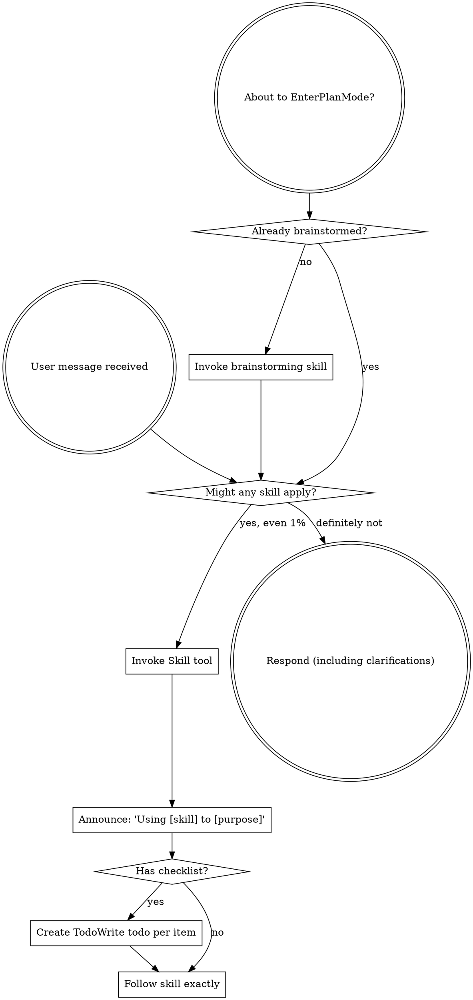

<SUBAGENT-STOP>
If you were dispatched as a subagent to execute a specific task, skip this skill.
</SUBAGENT-STOP>

<EXTREMELY-IMPORTANT>
If you think there is even a 1% chance a skill might apply to what you are doing, you ABSOLUTELY MUST invoke the skill.

IF A SKILL APPLIES TO YOUR TASK, YOU DO NOT HAVE A CHOICE. YOU MUST USE IT.

This is not negotiable. This is not optional. You cannot rationalize your way out of this.
</EXTREMELY-IMPORTANT>

## Instruction Priority

Superpowers skills override default system prompt behavior, but **user instructions always take precedence**:

1. **User's explicit instructions** (CLAUDE.md, GEMINI.md, AGENTS.md, direct requests) — highest priority
2. **Superpowers skills** — override default system behavior where they conflict
3. **Default system prompt** — lowest priority

If CLAUDE.md, GEMINI.md, or AGENTS.md says "don't use TDD" and a skill says "always use TDD," follow the user's instructions. The user is in control.

## How to Access Skills

**In Claude Code:** Use the `Skill` tool. When you invoke a skill, its content is loaded and presented to you—follow it directly. Never use the Read tool on skill files.

**In Copilot CLI:** Use the `skill` tool. Skills are auto-discovered from installed plugins. The `skill` tool works the same as Claude Code's `Skill` tool.

**In Gemini CLI:** Skills activate via the `activate_skill` tool. Gemini loads skill metadata at session start and activates the full content on demand.

**In other environments:** Check your platform's documentation for how skills are loaded.

## Platform Adaptation

Skills use Claude Code tool names. Non-CC platforms: see `references/copilot-tools.md` (Copilot CLI), `references/codex-tools.md` (Codex) for tool equivalents. Gemini CLI users get the tool mapping loaded automatically via GEMINI.md.

# Using Skills

## The Rule

**Invoke relevant or requested skills BEFORE any response or action.** Even a 1% chance a skill might apply means that you should invoke the skill to check. If an invoked skill turns out to be wrong for the situation, you don't need to use it.



## Red Flags

These thoughts mean STOP—you're rationalizing:

| Thought | Reality |
|---------|---------|
| "This is just a simple question" | Questions are tasks. Check for skills. |
| "I need more context first" | Skill check comes BEFORE clarifying questions. |
| "Let me explore the codebase first" | Skills tell you HOW to explore. Check first. |
| "I can check git/files quickly" | Files lack conversation context. Check for skills. |
| "Let me gather information first" | Skills tell you HOW to gather information. |
| "This doesn't need a formal skill" | If a skill exists, use it. |
| "I remember this skill" | Skills evolve. Read current version. |
| "This doesn't count as a task" | Action = task. Check for skills. |
| "The skill is overkill" | Simple things become complex. Use it. |
| "I'll just do this one thing first" | Check BEFORE doing anything. |
| "This feels productive" | Undisciplined action wastes time. Skills prevent this. |
| "I know what that means" | Knowing the concept ≠ using the skill. Invoke it. |

## Skill Priority

When multiple skills could apply, use this order:

1. **Process skills first** (brainstorming, debugging) - these determine HOW to approach the task
2. **Implementation skills second** (frontend-design, mcp-builder) - these guide execution

"Let's build X" → brainstorming first, then implementation skills.
"Fix this bug" → debugging first, then domain-specific skills.

## Skill Types

**Rigid** (TDD, debugging): Follow exactly. Don't adapt away discipline.

**Flexible** (patterns): Adapt principles to context.

The skill itself tells you which.

## User Instructions

Instructions say WHAT, not HOW. "Add X" or "Fix Y" doesn't mean skip workflows.

## Per-project configuration

UberDev reads optional config from `.claude/uberdev.local.md` in your project root. The file uses YAML frontmatter for typed settings:

```yaml
---
solve_tier_default: small        # one of: small, medium, large
review_depth: full               # one of: quick, full
solve_terminal: ghostty          # one of: ghostty, iterm, cmux
parallel_solve: true
auto_install_aliases: true       # boolean — auto-install /issue, /solve, /turbo, /simplify, /review-pr, /merge at SessionStart (default: true; env override: UBERDEV_NO_AUTO_ALIAS=1)
integration_branch: main         # branch /merge lands PRs into; default = repo default branch
auto_confirm: false              # boolean — when true, /merge skips the Phase 2.4 plan-confirm prompt and Phase 4.5 stale-branch prompts (CLI flag --yes wins per-run)
bot_authors_allow_list:          # PRs from these author logins bypass the
  - dependabot[bot]              # external-contributor refusal logic
  - renovate[bot]
---

# Notes (optional, free-form markdown for human reference)
```

Settings take effect on next SessionStart. Environment variables (`SOLVE_TERMINAL`, etc.) override file settings — use whichever is more convenient for your workflow.

**Auto-installed aliases:** UberDev's SessionStart hook installs six top-level forwarder commands (`/issue`, `/solve`, `/turbo`, `/simplify`, `/review-pr`, `/merge`) into `~/.claude/commands/` on first session and refreshes them on plugin upgrade. Hand-authored files at any of those paths are preserved (the hook detects them via a `managed-by: uberdev-aliases` marker and skips). Disable per-project with `auto_install_aliases: false` or globally with `UBERDEV_NO_AUTO_ALIAS=1`. Remove already-installed forwarders with `/uberdev:uninstall-aliases`.

**`integration_branch` precedence:** CLI flag `--integration-branch=<name>` > env var `UBERDEV_INTEGRATION_BRANCH` > config file (this YAML) > `gh repo view --json defaultBranchRef`. If all four tiers are empty, `/merge` asks once and offers to persist the answer to this file via an atomic `mktemp + mv` write.

**`bot_authors_allow_list` semantics:** literal `author.login` matched case-sensitively. Default covers Dependabot and Renovate.

**`auto_confirm` precedence:** CLI flag `--yes` / `-y` (per-run) > config file `auto_confirm: true|false` > scope-based default. Scope-based default: single-PR scope auto-confirms (the explicit PR number is the consent); `--all` / multi-PR scope prompts. Auto-confirm suppresses the Phase 2.4 plan `[y/N]` prompt and the Phase 4.5 stale-branch per-branch prompts; it never authorises destructive actions like auto-rebase — those still require explicit per-branch typed `yes` even when prompted.

**Recommendation:** commit this file to share workflow conventions across the team; or add it to `.gitignore` if individual preferences differ.
