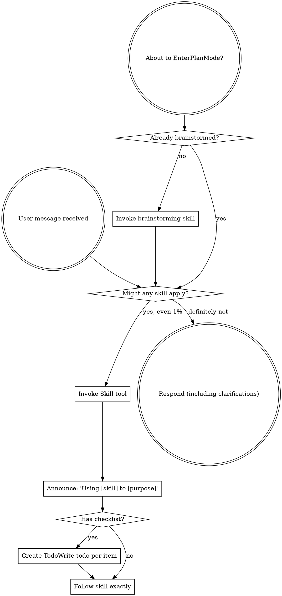

<SUBAGENT-STOP>
If you were dispatched as a subagent to execute a specific task, skip this skill.
</SUBAGENT-STOP>

<EXTREMELY-IMPORTANT>
If you think there is even a 1% chance a skill might apply to what you are doing, you ABSOLUTELY MUST invoke the skill.

IF A SKILL APPLIES TO YOUR TASK, YOU DO NOT HAVE A CHOICE. YOU MUST USE IT.

This is not negotiable. This is not optional. You cannot rationalize your way out of this.
</EXTREMELY-IMPORTANT>

## Instruction Priority

Superpowers skills override default system prompt behavior, but **user instructions always take precedence**:

1. **User's explicit instructions** (CLAUDE.md, GEMINI.md, AGENTS.md, direct requests) — highest priority
2. **Superpowers skills** — override default system behavior where they conflict
3. **Default system prompt** — lowest priority

If CLAUDE.md, GEMINI.md, or AGENTS.md says "don't use TDD" and a skill says "always use TDD," follow the user's instructions. The user is in control.

## How to Access Skills

**In Claude Code:** Use the `Skill` tool. When you invoke a skill, its content is loaded and presented to you—follow it directly. Never use the Read tool on skill files.

**In Copilot CLI:** Use the `skill` tool. Skills are auto-discovered from installed plugins. The `skill` tool works the same as Claude Code's `Skill` tool.

**In Gemini CLI:** Skills activate via the `activate_skill` tool. Gemini loads skill metadata at session start and activates the full content on demand.

**In other environments:** Check your platform's documentation for how skills are loaded.

## Platform Adaptation

Skills use Claude Code tool names. Non-CC platforms: see `references/copilot-tools.md` (Copilot CLI), `references/codex-tools.md` (Codex) for tool equivalents. Gemini CLI users get the tool mapping loaded automatically via GEMINI.md.

# Using Skills

## The Rule

**Invoke relevant or requested skills BEFORE any response or action.** Even a 1% chance a skill might apply means that you should invoke the skill to check. If an invoked skill turns out to be wrong for the situation, you don't need to use it.



## Red Flags

These thoughts mean STOP—you're rationalizing:

| Thought | Reality |
|---------|---------|
| "This is just a simple question" | Questions are tasks. Check for skills. |
| "I need more context first" | Skill check comes BEFORE clarifying questions. |
| "Let me explore the codebase first" | Skills tell you HOW to explore. Check first. |
| "I can check git/files quickly" | Files lack conversation context. Check for skills. |
| "Let me gather information first" | Skills tell you HOW to gather information. |
| "This doesn't need a formal skill" | If a skill exists, use it. |
| "I remember this skill" | Skills evolve. Read current version. |
| "This doesn't count as a task" | Action = task. Check for skills. |
| "The skill is overkill" | Simple things become complex. Use it. |
| "I'll just do this one thing first" | Check BEFORE doing anything. |
| "This feels productive" | Undisciplined action wastes time. Skills prevent this. |
| "I know what that means" | Knowing the concept ≠ using the skill. Invoke it. |

## Skill Priority

When multiple skills could apply, use this order:

1. **Process skills first** (brainstorming, debugging) - these determine HOW to approach the task
2. **Implementation skills second** (frontend-design, mcp-builder) - these guide execution

"Let's build X" → brainstorming first, then implementation skills.
"Fix this bug" → debugging first, then domain-specific skills.

## Skill Types

**Rigid** (TDD, debugging): Follow exactly. Don't adapt away discipline.

**Flexible** (patterns): Adapt principles to context.

The skill itself tells you which.

## User Instructions

Instructions say WHAT, not HOW. "Add X" or "Fix Y" doesn't mean skip workflows.

## Per-project configuration

UberDev reads optional config from `.claude/uberdev.local.md` in your project root. The file uses YAML frontmatter for typed settings:

```yaml
---
solve_tier_default: small        # one of: small, medium, large
review_depth: full               # one of: quick, full
parallel_solve: true
auto_install_aliases: true       # boolean — auto-install /issue, /solve, /turbo, /simplify, /review-pr, /merge at SessionStart (default: true; env override: UBERDEV_NO_AUTO_ALIAS=1)
integration_branch: main         # branch /merge lands PRs into; default = repo default branch
auto_review_on_merge: false      # boolean — when true, /merge Phase 1.4 auto-dispatches /review-pr <N> --turbo once per PR with missing trust trail (whitelisted reasons only); default false; env override: UBERDEV_AUTO_REVIEW_ON_MERGE (#89)
auto_confirm: false              # DEPRECATED — no behavioural effect. /merge is fully unattended (autopilot). Key parses for backward compat; first encounter emits a stderr deprecation notice.
bot_authors_allow_list:          # DEPRECATED — no behavioural effect. /merge no longer gates on PR-author identity (any APPROVED + CI-green PR is eligible). Key parses for backward compat.
  - dependabot[bot]
  - renovate[bot]

# --- /solve tier clamp ---
solve_tier_floor: small          # one of: trivial, small, medium, large; clamps auto-triage UP to floor; default unset (no lower clamp); env: SOLVE_TIER_FLOOR
solve_tier_ceiling: medium       # one of: trivial, small, medium, large; clamps auto-triage DOWN to ceiling; default unset (no upper clamp); env: SOLVE_TIER_CEILING

# --- per-phase parallel fanout caps ---
# dot-path refs: fanout_concurrency.research, fanout_concurrency.post_impl_review, fanout_concurrency.merge_strategy, fanout_concurrency.conflict_resolver
fanout_concurrency:
  research: 6                    # int [1, 50]; orchestrator Phase 1 research-fanout cap; default 6; env: UBERDEV_FANOUT_RESEARCH
  solve_bg: 6                    # int [1, 50]; /turbo parallel claude --bg fanout cap; default 6; env: UBERDEV_FANOUT_SOLVE_BG
  post_impl_review: 5            # int [1, 50]; post-impl-review reviewer fanout cap; default 5; env: UBERDEV_FANOUT_POST_IMPL_REVIEW
  merge_strategy: 10             # int [1, 50]; /merge Phase 2.2 strategy-decider fanout cap; default 10; env: UBERDEV_FANOUT_MERGE_STRATEGY (alias for MAX_PARALLEL_AGENTS in merge-pipeline/SKILL.md Constants)
  conflict_resolver: 10          # int [1, 50]; /merge Phase 3.3 conflict-resolver fanout cap; default 10; env: UBERDEV_FANOUT_CONFLICT_RESOLVER (NEW — Phase 3.3 was uncapped previously)

# --- per-command wall-clock timeouts ---
# dot-path refs: command_timeouts.solve, command_timeouts.review_pr, command_timeouts.merge
command_timeouts:
  solve: 3600                    # int seconds [60, 86400]; ENFORCED via /solve launcher timeout(1)/gtimeout wrap; default 3600 (1h); env: UBERDEV_SOLVE_TIMEOUT
  review_pr: 900                 # int seconds [60, 86400]; ADVISORY-ONLY in v1 (parsed + audit-logged; no kill); default 900 (15m); env: UBERDEV_REVIEW_PR_TIMEOUT
  merge: 600                     # int seconds [60, 86400]; ADVISORY-ONLY in v1 (parsed + audit-logged; no kill); default 600 (10m); env: UBERDEV_MERGE_TIMEOUT
---

# Notes (optional, free-form markdown for human reference)
```

Settings take effect on next SessionStart. Environment variables (`UBERDEV_FANOUT_SOLVE_BG`, `SOLVE_AUTO`, etc.) override file settings — use whichever is more convenient for your workflow.

**Auto-installed aliases:** UberDev's SessionStart hook installs six top-level forwarder commands (`/issue`, `/solve`, `/turbo`, `/simplify`, `/review-pr`, `/merge`) into `~/.claude/commands/` on first session and refreshes them on plugin upgrade. Hand-authored files at any of those paths are preserved (the hook detects them via a `managed-by: uberdev-aliases` marker and skips). Disable per-project with `auto_install_aliases: false` or globally with `UBERDEV_NO_AUTO_ALIAS=1`. Remove already-installed forwarders with `/uberdev:uninstall-aliases`.

**`integration_branch` precedence:** CLI flag `--integration-branch=<name>` > env var `UBERDEV_INTEGRATION_BRANCH` > config file (this YAML) > `gh repo view --json defaultBranchRef`. If all four tiers are empty, `/merge` falls back to the literal `main` and emits a one-line stderr warning — it does NOT prompt (autopilot is unconditional).

**`auto_review_on_merge` precedence (#89):** env var `UBERDEV_AUTO_REVIEW_ON_MERGE` > config file (this YAML) > default `false`. When `true`, `/merge` Phase 1.4 auto-dispatches `/review-pr <N> --turbo` once per PR per `/merge` run if the trust trail is missing (reasons `trust_trail_label_missing` or `trust_trail_trailer_missing` ONLY — see `merge-pipeline/SKILL.md` `## Common Mistakes` for the exhaustive exclusion list). Cap: 1 auto-review per `(pr_number, run_id)` composite key (no cross-run state). Audit: emits `auto_review_dispatched` (before) and `auto_review_returned` (after) per triggered PR. Default `false` is bit-identical to current `/merge` (zero new audit events, zero new wall-clock). Invalid values (anything outside `true|false`) fall back to default `false` non-fatally and emit a `uberdev_config_invalid` audit event via existing helper machinery.

**`bot_authors_allow_list` semantics:** **DEPRECATED.** As of the unconditional-autopilot release, `/merge` does NOT gate on PR-author identity — every APPROVED + CI-green PR is eligible regardless of whether the author is a collaborator, a bot, or an external contributor. Phase 1.4 trust resolution accepts EITHER `reviewDecision == "APPROVED"` (PATH_1, team / branch-protection path; required reviews + status checks anchor the trust) OR a green `/review-pr` trail bound to current HEAD SHA via the `trust-trail-evaluator` agent (PATH_2, solo-dev / no-protection path; the agent reads structural primitives — ancestor + diff-empty + log-empty — and returns verdicts in `{PASS, STALE, INVALID, FORCE_PUSHED}`). Author identity is NOT a gate in either path; the new trust trail does not re-introduce author-identity gating. The key is parsed without error for backward compat but has no behavioural effect.

**`auto_confirm` precedence:** **DEPRECATED.** As of the autopilot release, `auto_confirm` (config) and `--yes` / `-y` (CLI) are no-ops — `/merge` is fully unattended end-to-end. The flag is still parsed without error for backward compat; first encounter per run emits one stderr line: `warning: --yes / -y / auto_confirm are deprecated; /merge is now fully unattended. The flag has no behavioural effect.` An audit event `deprecated_flag_used` is recorded. No grace-window removal planned. See `commands/merge.md` `## Deprecated Flags`.

**`solve_tier_floor` / `solve_tier_ceiling`:** clamp the
`/solve` auto-triage tier into `[floor, ceiling]`. Both keys take an
enum value from `{trivial, small, medium, large}`. Asymmetric clamps
are supported (set only floor or only ceiling). If `floor > ceiling`,
one stderr warning fires (`floor_gt_ceiling`) and BOTH are ignored.
Env overrides: `SOLVE_TIER_FLOOR`, `SOLVE_TIER_CEILING`. Default:
unset on both sides.

**`fanout_concurrency.{research, post_impl_review, merge_strategy, conflict_resolver, solve_bg}`:**
per-phase cap on parallel agent fanout. Each value is an int in
`[1, 50]`. When the in-scope agent count exceeds the cap, the host
skill splits dispatch into `ceil(N / cap)` sequential single-message
waves (the per-wave single-message Task() invariant is preserved).
Useful for rate-limited tiers and laptop runs where 10 parallel Claude
sessions overwhelm RAM. `solve_bg` caps the number of parallel `claude --bg` background sessions dispatched by `/turbo` (and `/solve` when multiple issue numbers are passed). Larger queues split into `ceil(N / cap)` sequential single-message waves with per-wave `solve_bg_fanout_wave_started` audit events. Mirrors `merge_strategy` (`merge-pipeline/SKILL.md:401`).
Defaults: 6 / 5 / 10 / 10 / 6 respectively. Env overrides: `UBERDEV_FANOUT_{RESEARCH, POST_IMPL_REVIEW, MERGE_STRATEGY, CONFLICT_RESOLVER, SOLVE_BG}`. Note: `conflict_resolver`
introduces a NEW default cap of 10 in Phase 3.3 of `/merge`, where the
fanout was previously uncapped — queues of 11+ conflicted files in a
single PR now chunk into multiple waves (intentional behavioural
change; matches the `merge_strategy` chunking precedent).

**`command_timeouts.{solve, review_pr, merge}`:** per-command
wall-clock timeout in seconds, range `[60, 86400]` (1m–24h).
**Enforcement scope:** only `command_timeouts.solve` is enforced — the
`/solve` launcher wraps the `claude` invocation in `timeout(1)` (probing
`gtimeout` as a fallback, since `brew install coreutils` on macOS
installs the GNU binary under that name; fails-open with one stderr
warning if neither is on PATH).
`command_timeouts.{merge, review_pr}` are **ADVISORY-ONLY in v1**:
they are parsed and recorded in the audit log under
`uberdev_config_read` but NOT enforced as wall-clock kills, because
`/merge` and `/review-pr` execute inside the calling Claude turn and
enforcing kill semantics there requires deeper orchestrator-loop
changes. v2 issue can extend. Env overrides:
`UBERDEV_{SOLVE, REVIEW_PR, MERGE}_TIMEOUT`. Defaults: 3600 / 900 / 600.

**Validation behaviour:** absence of any new key yields the documented
default silently. Out-of-range / non-integer / invalid-enum values
emit one stderr line in the verbatim format
`warning: <KEY> = '<VAL>' is invalid (<REASON>); falling back to default <DEFAULT>`
and record one `uberdev_config_invalid` audit event; subsequent reads
within the same shell-process tree are silenced via the
`UBERDEV_VALIDATED_<KEY>=1` sentinel. Validation is always non-fatal —
no new key can abort the parent command.

**Recommendation:** commit this file to share workflow conventions across the team; or add it to `.gitignore` if individual preferences differ.
